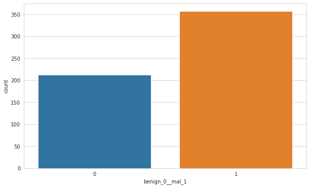
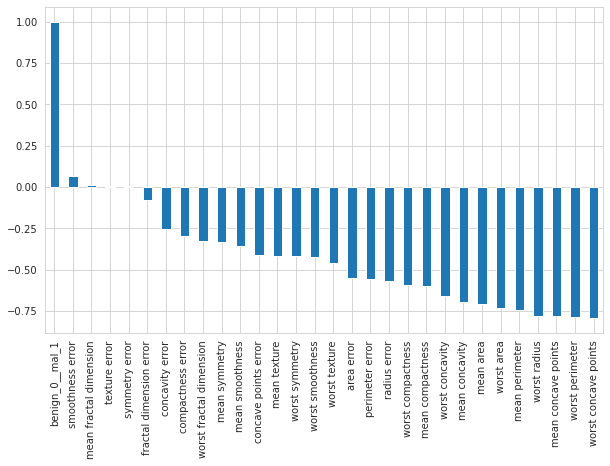
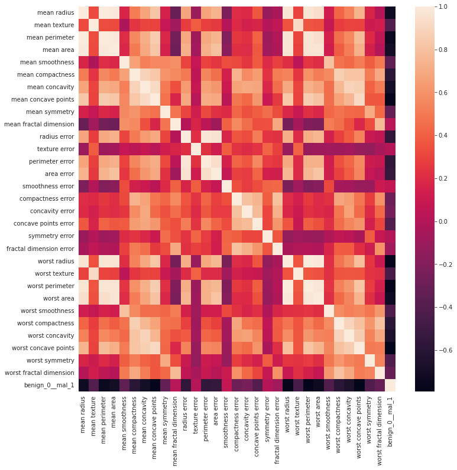
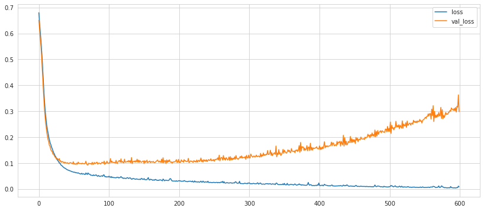
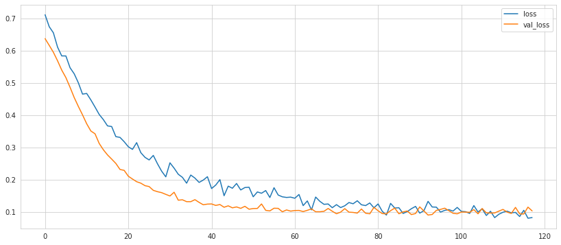

# Deep Learning: Classification using Keras for Breast Cancer 

Dataset: Wisconsin Study for Breast Cancer (https://goo.gl/U2Uwz2)


**Data Set Characteristics:**

    :Number of Instances: 569

    :Number of Attributes: 30 numeric, predictive attributes and the class

    :Attribute Information:
        - radius (mean of distances from center to points on the perimeter)
        - texture (standard deviation of gray-scale values)
        - perimeter
        - area
        - smoothness (local variation in radius lengths)
        - compactness (perimeter^2 / area - 1.0)
        - concavity (severity of concave portions of the contour)
        - concave points (number of concave portions of the contour)
        - symmetry 
        - fractal dimension ("coastline approximation" - 1)

        The mean, standard error, and "worst" or largest (mean of the three
        largest values) of these features were computed for each image,
        resulting in 30 features.  For instance, field 3 is Mean Radius, field
        13 is Radius SE, field 23 is Worst Radius.

        - class:
                - WDBC-Malignant
                - WDBC-Benign

    :Summary Statistics:

    ===================================== ====== ======
                                           Min    Max
    ===================================== ====== ======
    radius (mean):                        6.981  28.11
    texture (mean):                       9.71   39.28
    perimeter (mean):                     43.79  188.5
    area (mean):                          143.5  2501.0
    smoothness (mean):                    0.053  0.163
    compactness (mean):                   0.019  0.345
    concavity (mean):                     0.0    0.427
    concave points (mean):                0.0    0.201
    symmetry (mean):                      0.106  0.304
    fractal dimension (mean):             0.05   0.097
    radius (standard error):              0.112  2.873
    texture (standard error):             0.36   4.885
    perimeter (standard error):           0.757  21.98
    area (standard error):                6.802  542.2
    smoothness (standard error):          0.002  0.031
    compactness (standard error):         0.002  0.135
    concavity (standard error):           0.0    0.396
    concave points (standard error):      0.0    0.053
    symmetry (standard error):            0.008  0.079
    fractal dimension (standard error):   0.001  0.03
    radius (worst):                       7.93   36.04
    texture (worst):                      12.02  49.54
    perimeter (worst):                    50.41  251.2
    area (worst):                         185.2  4254.0
    smoothness (worst):                   0.071  0.223
    compactness (worst):                  0.027  1.058
    concavity (worst):                    0.0    1.252
    concave points (worst):               0.0    0.291
    symmetry (worst):                     0.156  0.664
    fractal dimension (worst):            0.055  0.208
    ===================================== ====== ======

    :Missing Attribute Values: None

    :Class Distribution: 212 - Malignant, 357 - Benign

    :Creator:  Dr. William H. Wolberg, W. Nick Street, Olvi L. Mangasarian

    :Donor: Nick Street

    :Date: November, 1995

## Imports


```python
import pandas as pd
import numpy as np
import matplotlib.pyplot as plt
import seaborn as sns
```


```python
df = pd.read_csv("../DATA/cancer_classification.csv")
```


```python
df.head()
```


<div>
<style scoped>
    .dataframe tbody tr th:only-of-type {
        vertical-align: middle;
    }

    .dataframe tbody tr th {
        vertical-align: top;
    }

    .dataframe thead th {
        text-align: right;
    }
</style>
<table border="1" class="dataframe">
  <thead>
    <tr style="text-align: right;">
      <th></th>
      <th>mean radius</th>
      <th>mean texture</th>
      <th>mean perimeter</th>
      <th>mean area</th>
      <th>mean smoothness</th>
      <th>mean compactness</th>
      <th>mean concavity</th>
      <th>mean concave points</th>
      <th>mean symmetry</th>
      <th>mean fractal dimension</th>
      <th>...</th>
      <th>worst texture</th>
      <th>worst perimeter</th>
      <th>worst area</th>
      <th>worst smoothness</th>
      <th>worst compactness</th>
      <th>worst concavity</th>
      <th>worst concave points</th>
      <th>worst symmetry</th>
      <th>worst fractal dimension</th>
      <th>benign_0__mal_1</th>
    </tr>
  </thead>
  <tbody>
    <tr>
      <th>0</th>
      <td>17.99</td>
      <td>10.38</td>
      <td>122.80</td>
      <td>1001.0</td>
      <td>0.11840</td>
      <td>0.27760</td>
      <td>0.3001</td>
      <td>0.14710</td>
      <td>0.2419</td>
      <td>0.07871</td>
      <td>...</td>
      <td>17.33</td>
      <td>184.60</td>
      <td>2019.0</td>
      <td>0.1622</td>
      <td>0.6656</td>
      <td>0.7119</td>
      <td>0.2654</td>
      <td>0.4601</td>
      <td>0.11890</td>
      <td>0</td>
    </tr>
    <tr>
      <th>1</th>
      <td>20.57</td>
      <td>17.77</td>
      <td>132.90</td>
      <td>1326.0</td>
      <td>0.08474</td>
      <td>0.07864</td>
      <td>0.0869</td>
      <td>0.07017</td>
      <td>0.1812</td>
      <td>0.05667</td>
      <td>...</td>
      <td>23.41</td>
      <td>158.80</td>
      <td>1956.0</td>
      <td>0.1238</td>
      <td>0.1866</td>
      <td>0.2416</td>
      <td>0.1860</td>
      <td>0.2750</td>
      <td>0.08902</td>
      <td>0</td>
    </tr>
    <tr>
      <th>2</th>
      <td>19.69</td>
      <td>21.25</td>
      <td>130.00</td>
      <td>1203.0</td>
      <td>0.10960</td>
      <td>0.15990</td>
      <td>0.1974</td>
      <td>0.12790</td>
      <td>0.2069</td>
      <td>0.05999</td>
      <td>...</td>
      <td>25.53</td>
      <td>152.50</td>
      <td>1709.0</td>
      <td>0.1444</td>
      <td>0.4245</td>
      <td>0.4504</td>
      <td>0.2430</td>
      <td>0.3613</td>
      <td>0.08758</td>
      <td>0</td>
    </tr>
    <tr>
      <th>3</th>
      <td>11.42</td>
      <td>20.38</td>
      <td>77.58</td>
      <td>386.1</td>
      <td>0.14250</td>
      <td>0.28390</td>
      <td>0.2414</td>
      <td>0.10520</td>
      <td>0.2597</td>
      <td>0.09744</td>
      <td>...</td>
      <td>26.50</td>
      <td>98.87</td>
      <td>567.7</td>
      <td>0.2098</td>
      <td>0.8663</td>
      <td>0.6869</td>
      <td>0.2575</td>
      <td>0.6638</td>
      <td>0.17300</td>
      <td>0</td>
    </tr>
    <tr>
      <th>4</th>
      <td>20.29</td>
      <td>14.34</td>
      <td>135.10</td>
      <td>1297.0</td>
      <td>0.10030</td>
      <td>0.13280</td>
      <td>0.1980</td>
      <td>0.10430</td>
      <td>0.1809</td>
      <td>0.05883</td>
      <td>...</td>
      <td>16.67</td>
      <td>152.20</td>
      <td>1575.0</td>
      <td>0.1374</td>
      <td>0.2050</td>
      <td>0.4000</td>
      <td>0.1625</td>
      <td>0.2364</td>
      <td>0.07678</td>
      <td>0</td>
    </tr>
  </tbody>
</table>
<p>5 rows × 31 columns</p>
</div>


```python
df.describe().transpose()
```


<div>
<style scoped>
    .dataframe tbody tr th:only-of-type {
        vertical-align: middle;
    }

    .dataframe tbody tr th {
        vertical-align: top;
    }

    .dataframe thead th {
        text-align: right;
    }
</style>
<table border="1" class="dataframe">
  <thead>
    <tr style="text-align: right;">
      <th></th>
      <th>count</th>
      <th>mean</th>
      <th>std</th>
      <th>min</th>
      <th>25%</th>
      <th>50%</th>
      <th>75%</th>
      <th>max</th>
    </tr>
  </thead>
  <tbody>
    <tr>
      <th>mean radius</th>
      <td>569.0</td>
      <td>14.127292</td>
      <td>3.524049</td>
      <td>6.981000</td>
      <td>11.700000</td>
      <td>13.370000</td>
      <td>15.780000</td>
      <td>28.11000</td>
    </tr>
    <tr>
      <th>mean texture</th>
      <td>569.0</td>
      <td>19.289649</td>
      <td>4.301036</td>
      <td>9.710000</td>
      <td>16.170000</td>
      <td>18.840000</td>
      <td>21.800000</td>
      <td>39.28000</td>
    </tr>
    <tr>
      <th>mean perimeter</th>
      <td>569.0</td>
      <td>91.969033</td>
      <td>24.298981</td>
      <td>43.790000</td>
      <td>75.170000</td>
      <td>86.240000</td>
      <td>104.100000</td>
      <td>188.50000</td>
    </tr>
    <tr>
      <th>mean area</th>
      <td>569.0</td>
      <td>654.889104</td>
      <td>351.914129</td>
      <td>143.500000</td>
      <td>420.300000</td>
      <td>551.100000</td>
      <td>782.700000</td>
      <td>2501.00000</td>
    </tr>
    <tr>
      <th>mean smoothness</th>
      <td>569.0</td>
      <td>0.096360</td>
      <td>0.014064</td>
      <td>0.052630</td>
      <td>0.086370</td>
      <td>0.095870</td>
      <td>0.105300</td>
      <td>0.16340</td>
    </tr>
    <tr>
      <th>mean compactness</th>
      <td>569.0</td>
      <td>0.104341</td>
      <td>0.052813</td>
      <td>0.019380</td>
      <td>0.064920</td>
      <td>0.092630</td>
      <td>0.130400</td>
      <td>0.34540</td>
    </tr>
    <tr>
      <th>mean concavity</th>
      <td>569.0</td>
      <td>0.088799</td>
      <td>0.079720</td>
      <td>0.000000</td>
      <td>0.029560</td>
      <td>0.061540</td>
      <td>0.130700</td>
      <td>0.42680</td>
    </tr>
    <tr>
      <th>mean concave points</th>
      <td>569.0</td>
      <td>0.048919</td>
      <td>0.038803</td>
      <td>0.000000</td>
      <td>0.020310</td>
      <td>0.033500</td>
      <td>0.074000</td>
      <td>0.20120</td>
    </tr>
    <tr>
      <th>mean symmetry</th>
      <td>569.0</td>
      <td>0.181162</td>
      <td>0.027414</td>
      <td>0.106000</td>
      <td>0.161900</td>
      <td>0.179200</td>
      <td>0.195700</td>
      <td>0.30400</td>
    </tr>
    <tr>
      <th>mean fractal dimension</th>
      <td>569.0</td>
      <td>0.062798</td>
      <td>0.007060</td>
      <td>0.049960</td>
      <td>0.057700</td>
      <td>0.061540</td>
      <td>0.066120</td>
      <td>0.09744</td>
    </tr>
    <tr>
      <th>radius error</th>
      <td>569.0</td>
      <td>0.405172</td>
      <td>0.277313</td>
      <td>0.111500</td>
      <td>0.232400</td>
      <td>0.324200</td>
      <td>0.478900</td>
      <td>2.87300</td>
    </tr>
    <tr>
      <th>texture error</th>
      <td>569.0</td>
      <td>1.216853</td>
      <td>0.551648</td>
      <td>0.360200</td>
      <td>0.833900</td>
      <td>1.108000</td>
      <td>1.474000</td>
      <td>4.88500</td>
    </tr>
    <tr>
      <th>perimeter error</th>
      <td>569.0</td>
      <td>2.866059</td>
      <td>2.021855</td>
      <td>0.757000</td>
      <td>1.606000</td>
      <td>2.287000</td>
      <td>3.357000</td>
      <td>21.98000</td>
    </tr>
    <tr>
      <th>area error</th>
      <td>569.0</td>
      <td>40.337079</td>
      <td>45.491006</td>
      <td>6.802000</td>
      <td>17.850000</td>
      <td>24.530000</td>
      <td>45.190000</td>
      <td>542.20000</td>
    </tr>
    <tr>
      <th>smoothness error</th>
      <td>569.0</td>
      <td>0.007041</td>
      <td>0.003003</td>
      <td>0.001713</td>
      <td>0.005169</td>
      <td>0.006380</td>
      <td>0.008146</td>
      <td>0.03113</td>
    </tr>
    <tr>
      <th>compactness error</th>
      <td>569.0</td>
      <td>0.025478</td>
      <td>0.017908</td>
      <td>0.002252</td>
      <td>0.013080</td>
      <td>0.020450</td>
      <td>0.032450</td>
      <td>0.13540</td>
    </tr>
    <tr>
      <th>concavity error</th>
      <td>569.0</td>
      <td>0.031894</td>
      <td>0.030186</td>
      <td>0.000000</td>
      <td>0.015090</td>
      <td>0.025890</td>
      <td>0.042050</td>
      <td>0.39600</td>
    </tr>
    <tr>
      <th>concave points error</th>
      <td>569.0</td>
      <td>0.011796</td>
      <td>0.006170</td>
      <td>0.000000</td>
      <td>0.007638</td>
      <td>0.010930</td>
      <td>0.014710</td>
      <td>0.05279</td>
    </tr>
    <tr>
      <th>symmetry error</th>
      <td>569.0</td>
      <td>0.020542</td>
      <td>0.008266</td>
      <td>0.007882</td>
      <td>0.015160</td>
      <td>0.018730</td>
      <td>0.023480</td>
      <td>0.07895</td>
    </tr>
    <tr>
      <th>fractal dimension error</th>
      <td>569.0</td>
      <td>0.003795</td>
      <td>0.002646</td>
      <td>0.000895</td>
      <td>0.002248</td>
      <td>0.003187</td>
      <td>0.004558</td>
      <td>0.02984</td>
    </tr>
    <tr>
      <th>worst radius</th>
      <td>569.0</td>
      <td>16.269190</td>
      <td>4.833242</td>
      <td>7.930000</td>
      <td>13.010000</td>
      <td>14.970000</td>
      <td>18.790000</td>
      <td>36.04000</td>
    </tr>
    <tr>
      <th>worst texture</th>
      <td>569.0</td>
      <td>25.677223</td>
      <td>6.146258</td>
      <td>12.020000</td>
      <td>21.080000</td>
      <td>25.410000</td>
      <td>29.720000</td>
      <td>49.54000</td>
    </tr>
    <tr>
      <th>worst perimeter</th>
      <td>569.0</td>
      <td>107.261213</td>
      <td>33.602542</td>
      <td>50.410000</td>
      <td>84.110000</td>
      <td>97.660000</td>
      <td>125.400000</td>
      <td>251.20000</td>
    </tr>
    <tr>
      <th>worst area</th>
      <td>569.0</td>
      <td>880.583128</td>
      <td>569.356993</td>
      <td>185.200000</td>
      <td>515.300000</td>
      <td>686.500000</td>
      <td>1084.000000</td>
      <td>4254.00000</td>
    </tr>
    <tr>
      <th>worst smoothness</th>
      <td>569.0</td>
      <td>0.132369</td>
      <td>0.022832</td>
      <td>0.071170</td>
      <td>0.116600</td>
      <td>0.131300</td>
      <td>0.146000</td>
      <td>0.22260</td>
    </tr>
    <tr>
      <th>worst compactness</th>
      <td>569.0</td>
      <td>0.254265</td>
      <td>0.157336</td>
      <td>0.027290</td>
      <td>0.147200</td>
      <td>0.211900</td>
      <td>0.339100</td>
      <td>1.05800</td>
    </tr>
    <tr>
      <th>worst concavity</th>
      <td>569.0</td>
      <td>0.272188</td>
      <td>0.208624</td>
      <td>0.000000</td>
      <td>0.114500</td>
      <td>0.226700</td>
      <td>0.382900</td>
      <td>1.25200</td>
    </tr>
    <tr>
      <th>worst concave points</th>
      <td>569.0</td>
      <td>0.114606</td>
      <td>0.065732</td>
      <td>0.000000</td>
      <td>0.064930</td>
      <td>0.099930</td>
      <td>0.161400</td>
      <td>0.29100</td>
    </tr>
    <tr>
      <th>worst symmetry</th>
      <td>569.0</td>
      <td>0.290076</td>
      <td>0.061867</td>
      <td>0.156500</td>
      <td>0.250400</td>
      <td>0.282200</td>
      <td>0.317900</td>
      <td>0.66380</td>
    </tr>
    <tr>
      <th>worst fractal dimension</th>
      <td>569.0</td>
      <td>0.083946</td>
      <td>0.018061</td>
      <td>0.055040</td>
      <td>0.071460</td>
      <td>0.080040</td>
      <td>0.092080</td>
      <td>0.20750</td>
    </tr>
    <tr>
      <th>benign_0__mal_1</th>
      <td>569.0</td>
      <td>0.627417</td>
      <td>0.483918</td>
      <td>0.000000</td>
      <td>0.000000</td>
      <td>1.000000</td>
      <td>1.000000</td>
      <td>1.00000</td>
    </tr>
  </tbody>
</table>
</div>


```python
df.info()
```

    <class 'pandas.core.frame.DataFrame'>
    RangeIndex: 569 entries, 0 to 568
    Data columns (total 31 columns):
     #   Column                   Non-Null Count  Dtype  
    ---  ------                   --------------  -----  
     0   mean radius              569 non-null    float64
     1   mean texture             569 non-null    float64
     2   mean perimeter           569 non-null    float64
     3   mean area                569 non-null    float64
     4   mean smoothness          569 non-null    float64
     5   mean compactness         569 non-null    float64
     6   mean concavity           569 non-null    float64
     7   mean concave points      569 non-null    float64
     8   mean symmetry            569 non-null    float64
     9   mean fractal dimension   569 non-null    float64
     10  radius error             569 non-null    float64
     11  texture error            569 non-null    float64
     12  perimeter error          569 non-null    float64
     13  area error               569 non-null    float64
     14  smoothness error         569 non-null    float64
     15  compactness error        569 non-null    float64
     16  concavity error          569 non-null    float64
     17  concave points error     569 non-null    float64
     18  symmetry error           569 non-null    float64
     19  fractal dimension error  569 non-null    float64
     20  worst radius             569 non-null    float64
     21  worst texture            569 non-null    float64
     22  worst perimeter          569 non-null    float64
     23  worst area               569 non-null    float64
     24  worst smoothness         569 non-null    float64
     25  worst compactness        569 non-null    float64
     26  worst concavity          569 non-null    float64
     27  worst concave points     569 non-null    float64
     28  worst symmetry           569 non-null    float64
     29  worst fractal dimension  569 non-null    float64
     30  benign_0__mal_1          569 non-null    int64  
    dtypes: float64(30), int64(1)
    memory usage: 137.9 KB


## Data Visualisation


```python
plt.figure(figsize=(10,6))
sns.set_style("whitegrid")
sns.countplot(data=df,x="benign_0__mal_1")
```


    <AxesSubplot:xlabel='benign_0__mal_1', ylabel='count'>


    

    


```python
plt.figure(figsize=(10,6))
df.corr()["benign_0__mal_1"][1:].sort_values(ascending=False).plot(kind="bar")
```


    <AxesSubplot:>


    

    


```python
plt.figure(figsize=(12,12))
sns.heatmap(df.corr())
```


    <AxesSubplot:>


    

    


## Model Training


```python
X = df.drop("benign_0__mal_1",axis=1).values
y = df["benign_0__mal_1"].values
```


```python
from sklearn.model_selection import train_test_split

X_train,X_test,y_train,y_test = train_test_split(X,y,test_size=0.25,random_state=101)
```


```python
from sklearn.preprocessing import MinMaxScaler

scaler = MinMaxScaler()
```


```python
X_train = scaler.fit_transform(X_train)
```


```python
X_test = scaler.transform(X_test)
```


```python
from tensorflow.keras.models import Sequential
from tensorflow.keras.layers import Dense, Dropout
```


```python
X_train.shape
```


    (426, 30)


```python
model = Sequential()

model.add((Dense(30,activation="relu")))

model.add((Dense(15,activation="relu")))

# Binary Classification therefore activation function is sigmoid
model.add((Dense(1,activation="sigmoid")))

model.compile(loss="binary_crossentropy",optimizer="adam")
```

We are intentionally attempting to overfit the model into the dataset, to study how we can overcome this.


```python
model.fit(x=X_train,y=y_train,epochs=600,validation_data=(X_test,y_test))
```

    Epoch 1/600
    14/14 [==============================] - 1s 11ms/step - loss: 0.6798 - val_loss: 0.6511
    Epoch 2/600
    14/14 [==============================] - 0s 4ms/step - loss: 0.6394 - val_loss: 0.6144
    Epoch 3/600
    14/14 [==============================] - 0s 4ms/step - loss: 0.6044 - val_loss: 0.5814
    Epoch 4/600
    14/14 [==============================] - 0s 4ms/step - loss: 0.5700 - val_loss: 0.5467
    Epoch 5/600
    14/14 [==============================] - 0s 5ms/step - loss: 0.5308 - val_loss: 0.5051
    Epoch 6/600
    14/14 [==============================] - 0s 4ms/step - loss: 0.4857 - val_loss: 0.4556
    Epoch 7/600
    14/14 [==============================] - 0s 6ms/step - loss: 0.4350 - val_loss: 0.4018
    Epoch 8/600
    14/14 [==============================] - 0s 5ms/step - loss: 0.3834 - val_loss: 0.3510
    Epoch 9/600
    14/14 [==============================] - 0s 4ms/step - loss: 0.3394 - val_loss: 0.3078
    Epoch 10/600
    14/14 [==============================] - 0s 4ms/step - loss: 0.3009 - val_loss: 0.2739
    Epoch 11/600
    14/14 [==============================] - 0s 4ms/step - loss: 0.2758 - val_loss: 0.2478
    Epoch 12/600
    14/14 [==============================] - 0s 4ms/step - loss: 0.2492 - val_loss: 0.2243
    Epoch 13/600
    14/14 [==============================] - 0s 5ms/step - loss: 0.2311 - val_loss: 0.2066
    Epoch 14/600
    14/14 [==============================] - 0s 4ms/step - loss: 0.2179 - val_loss: 0.1917
    Epoch 15/600
    14/14 [==============================] - 0s 4ms/step - loss: 0.2005 - val_loss: 0.1829
    Epoch 16/600
    14/14 [==============================] - 0s 4ms/step - loss: 0.1901 - val_loss: 0.1679
    Epoch 17/600
    14/14 [==============================] - 0s 4ms/step - loss: 0.1783 - val_loss: 0.1647
    Epoch 18/600
    14/14 [==============================] - 0s 4ms/step - loss: 0.1718 - val_loss: 0.1519
    Epoch 19/600
    14/14 [==============================] - 0s 4ms/step - loss: 0.1621 - val_loss: 0.1464
    Epoch 20/600
    14/14 [==============================] - 0s 4ms/step - loss: 0.1555 - val_loss: 0.1445
    Epoch 21/600
    14/14 [==============================] - 0s 4ms/step - loss: 0.1481 - val_loss: 0.1346
    Epoch 22/600
    14/14 [==============================] - 0s 5ms/step - loss: 0.1398 - val_loss: 0.1344
    Epoch 23/600
    14/14 [==============================] - 0s 4ms/step - loss: 0.1358 - val_loss: 0.1289
    Epoch 24/600
    14/14 [==============================] - 0s 4ms/step - loss: 0.1284 - val_loss: 0.1233
    Epoch 25/600
    14/14 [==============================] - 0s 4ms/step - loss: 0.1246 - val_loss: 0.1208
    Epoch 26/600
    14/14 [==============================] - 0s 4ms/step - loss: 0.1188 - val_loss: 0.1158
    Epoch 27/600
    14/14 [==============================] - 0s 4ms/step - loss: 0.1135 - val_loss: 0.1188
    Epoch 28/600
    14/14 [==============================] - 0s 4ms/step - loss: 0.1092 - val_loss: 0.1154
    Epoch 29/600
    14/14 [==============================] - 0s 5ms/step - loss: 0.1068 - val_loss: 0.1113
    Epoch 30/600
    14/14 [==============================] - 0s 5ms/step - loss: 0.1004 - val_loss: 0.1175
    Epoch 31/600
    14/14 [==============================] - 0s 4ms/step - loss: 0.1006 - val_loss: 0.1064
    Epoch 32/600
    14/14 [==============================] - 0s 5ms/step - loss: 0.0944 - val_loss: 0.1094
    Epoch 33/600
    14/14 [==============================] - 0s 4ms/step - loss: 0.0913 - val_loss: 0.1030
    Epoch 34/600
    14/14 [==============================] - 0s 4ms/step - loss: 0.0899 - val_loss: 0.1058
    Epoch 35/600
    14/14 [==============================] - 0s 4ms/step - loss: 0.0865 - val_loss: 0.1061
    Epoch 36/600
    14/14 [==============================] - 0s 5ms/step - loss: 0.0845 - val_loss: 0.1030
    Epoch 37/600
    14/14 [==============================] - 0s 6ms/step - loss: 0.0818 - val_loss: 0.0999
    Epoch 38/600
    14/14 [==============================] - 0s 4ms/step - loss: 0.0809 - val_loss: 0.1041
    Epoch 39/600
    14/14 [==============================] - 0s 6ms/step - loss: 0.0788 - val_loss: 0.1004
    Epoch 40/600
    14/14 [==============================] - 0s 4ms/step - loss: 0.0772 - val_loss: 0.1012
    Epoch 41/600
    14/14 [==============================] - 0s 6ms/step - loss: 0.0750 - val_loss: 0.0996
    Epoch 42/600
    14/14 [==============================] - 0s 7ms/step - loss: 0.0739 - val_loss: 0.1017
    Epoch 43/600
    14/14 [==============================] - 0s 7ms/step - loss: 0.0724 - val_loss: 0.0982
    Epoch 44/600
    14/14 [==============================] - 0s 7ms/step - loss: 0.0722 - val_loss: 0.0979
    Epoch 45/600
    14/14 [==============================] - 0s 6ms/step - loss: 0.0703 - val_loss: 0.1015
    Epoch 46/600
    14/14 [==============================] - 0s 5ms/step - loss: 0.0697 - val_loss: 0.1016
    Epoch 47/600
    14/14 [==============================] - 0s 4ms/step - loss: 0.0684 - val_loss: 0.1007
    Epoch 48/600
    14/14 [==============================] - 0s 6ms/step - loss: 0.0671 - val_loss: 0.0990
    Epoch 49/600
    14/14 [==============================] - 0s 7ms/step - loss: 0.0667 - val_loss: 0.0970
    Epoch 50/600
    14/14 [==============================] - 0s 5ms/step - loss: 0.0656 - val_loss: 0.1054
    Epoch 51/600
    14/14 [==============================] - 0s 5ms/step - loss: 0.0644 - val_loss: 0.0955
    Epoch 52/600
    14/14 [==============================] - 0s 6ms/step - loss: 0.0653 - val_loss: 0.0976
    Epoch 53/600
    14/14 [==============================] - 0s 6ms/step - loss: 0.0631 - val_loss: 0.0960
    Epoch 54/600
    14/14 [==============================] - 0s 4ms/step - loss: 0.0634 - val_loss: 0.0953
    Epoch 55/600
    14/14 [==============================] - 0s 5ms/step - loss: 0.0628 - val_loss: 0.1002
    Epoch 56/600
    14/14 [==============================] - 0s 8ms/step - loss: 0.0614 - val_loss: 0.0959
    Epoch 57/600
    14/14 [==============================] - 0s 5ms/step - loss: 0.0628 - val_loss: 0.1039
    Epoch 58/600
    14/14 [==============================] - 0s 5ms/step - loss: 0.0608 - val_loss: 0.0983
    Epoch 59/600
    14/14 [==============================] - 0s 5ms/step - loss: 0.0596 - val_loss: 0.0993
    Epoch 60/600
    14/14 [==============================] - 0s 4ms/step - loss: 0.0584 - val_loss: 0.0981
    Epoch 61/600
    14/14 [==============================] - 0s 4ms/step - loss: 0.0583 - val_loss: 0.0991
    Epoch 62/600
    14/14 [==============================] - 0s 5ms/step - loss: 0.0608 - val_loss: 0.0968
    Epoch 63/600
    14/14 [==============================] - 0s 6ms/step - loss: 0.0575 - val_loss: 0.1001
    Epoch 64/600
    14/14 [==============================] - 0s 5ms/step - loss: 0.0585 - val_loss: 0.0978
    Epoch 65/600
    14/14 [==============================] - 0s 4ms/step - loss: 0.0588 - val_loss: 0.0984
    Epoch 66/600
    14/14 [==============================] - 0s 4ms/step - loss: 0.0569 - val_loss: 0.0969
    Epoch 67/600
    14/14 [==============================] - 0s 5ms/step - loss: 0.0559 - val_loss: 0.0989
    Epoch 68/600
    14/14 [==============================] - 0s 5ms/step - loss: 0.0621 - val_loss: 0.1073
    Epoch 69/600
    14/14 [==============================] - 0s 5ms/step - loss: 0.0593 - val_loss: 0.0976
    Epoch 70/600
    14/14 [==============================] - 0s 9ms/step - loss: 0.0561 - val_loss: 0.0929
    Epoch 71/600
    14/14 [==============================] - 0s 7ms/step - loss: 0.0622 - val_loss: 0.0929
    Epoch 72/600
    14/14 [==============================] - 0s 5ms/step - loss: 0.0584 - val_loss: 0.1000
    Epoch 73/600
    14/14 [==============================] - 0s 6ms/step - loss: 0.0573 - val_loss: 0.0979
    Epoch 74/600
    14/14 [==============================] - 0s 6ms/step - loss: 0.0564 - val_loss: 0.0977
    Epoch 75/600
    14/14 [==============================] - 0s 6ms/step - loss: 0.0531 - val_loss: 0.0986
    Epoch 76/600
    14/14 [==============================] - 0s 7ms/step - loss: 0.0533 - val_loss: 0.0953
    Epoch 77/600
    14/14 [==============================] - 0s 6ms/step - loss: 0.0531 - val_loss: 0.1032
    Epoch 78/600
    14/14 [==============================] - 0s 6ms/step - loss: 0.0517 - val_loss: 0.0952
    Epoch 79/600
    14/14 [==============================] - 0s 5ms/step - loss: 0.0547 - val_loss: 0.0961
    Epoch 80/600
    14/14 [==============================] - 0s 4ms/step - loss: 0.0524 - val_loss: 0.1028
    Epoch 81/600
    14/14 [==============================] - 0s 7ms/step - loss: 0.0524 - val_loss: 0.0975
    Epoch 82/600
    14/14 [==============================] - 0s 9ms/step - loss: 0.0545 - val_loss: 0.0994
    Epoch 83/600
    14/14 [==============================] - 0s 8ms/step - loss: 0.0542 - val_loss: 0.1028
    Epoch 84/600
    14/14 [==============================] - 0s 5ms/step - loss: 0.0503 - val_loss: 0.1034
    Epoch 85/600
    14/14 [==============================] - 0s 5ms/step - loss: 0.0495 - val_loss: 0.0957
    Epoch 86/600
    14/14 [==============================] - 0s 4ms/step - loss: 0.0525 - val_loss: 0.0996
    Epoch 87/600
    14/14 [==============================] - 0s 4ms/step - loss: 0.0497 - val_loss: 0.1005
    Epoch 88/600
    14/14 [==============================] - 0s 4ms/step - loss: 0.0486 - val_loss: 0.0990
    Epoch 89/600
    14/14 [==============================] - 0s 4ms/step - loss: 0.0496 - val_loss: 0.0965
    Epoch 90/600
    14/14 [==============================] - 0s 4ms/step - loss: 0.0507 - val_loss: 0.0997
    Epoch 91/600
    14/14 [==============================] - 0s 5ms/step - loss: 0.0510 - val_loss: 0.1034
    Epoch 92/600
    14/14 [==============================] - 0s 7ms/step - loss: 0.0489 - val_loss: 0.1016
    Epoch 93/600
    14/14 [==============================] - 0s 5ms/step - loss: 0.0545 - val_loss: 0.0994
    Epoch 94/600
    14/14 [==============================] - 0s 4ms/step - loss: 0.0544 - val_loss: 0.1077
    Epoch 95/600
    14/14 [==============================] - 0s 4ms/step - loss: 0.0477 - val_loss: 0.0948
    Epoch 96/600
    14/14 [==============================] - 0s 4ms/step - loss: 0.0483 - val_loss: 0.1011
    Epoch 97/600
    14/14 [==============================] - 0s 4ms/step - loss: 0.0460 - val_loss: 0.0988
    Epoch 98/600
    14/14 [==============================] - 0s 4ms/step - loss: 0.0477 - val_loss: 0.1073
    Epoch 99/600
    14/14 [==============================] - 0s 4ms/step - loss: 0.0467 - val_loss: 0.1004
    Epoch 100/600
    14/14 [==============================] - 0s 4ms/step - loss: 0.0465 - val_loss: 0.0992
    Epoch 101/600
    14/14 [==============================] - 0s 4ms/step - loss: 0.0498 - val_loss: 0.1013
    Epoch 102/600
    14/14 [==============================] - 0s 4ms/step - loss: 0.0464 - val_loss: 0.0994
    Epoch 103/600
    14/14 [==============================] - 0s 4ms/step - loss: 0.0450 - val_loss: 0.1176
    Epoch 104/600
    14/14 [==============================] - 0s 4ms/step - loss: 0.0483 - val_loss: 0.1021
    Epoch 105/600
    14/14 [==============================] - 0s 4ms/step - loss: 0.0442 - val_loss: 0.1079
    Epoch 106/600
    14/14 [==============================] - 0s 4ms/step - loss: 0.0461 - val_loss: 0.1028
    Epoch 107/600
    14/14 [==============================] - 0s 4ms/step - loss: 0.0449 - val_loss: 0.1032
    Epoch 108/600
    14/14 [==============================] - 0s 4ms/step - loss: 0.0436 - val_loss: 0.1028
    Epoch 109/600
    14/14 [==============================] - 0s 4ms/step - loss: 0.0444 - val_loss: 0.1023
    Epoch 110/600
    14/14 [==============================] - 0s 4ms/step - loss: 0.0435 - val_loss: 0.0997
    Epoch 111/600
    14/14 [==============================] - 0s 4ms/step - loss: 0.0432 - val_loss: 0.1108
    Epoch 112/600
    14/14 [==============================] - 0s 5ms/step - loss: 0.0453 - val_loss: 0.0992
    Epoch 113/600
    14/14 [==============================] - 0s 5ms/step - loss: 0.0449 - val_loss: 0.0990
    Epoch 114/600
    14/14 [==============================] - 0s 4ms/step - loss: 0.0456 - val_loss: 0.1064
    Epoch 115/600
    14/14 [==============================] - 0s 4ms/step - loss: 0.0426 - val_loss: 0.1087
    Epoch 116/600
    14/14 [==============================] - 0s 5ms/step - loss: 0.0442 - val_loss: 0.1104
    Epoch 117/600
    14/14 [==============================] - 0s 4ms/step - loss: 0.0448 - val_loss: 0.1031
    Epoch 118/600
    14/14 [==============================] - 0s 4ms/step - loss: 0.0481 - val_loss: 0.1162
    Epoch 119/600
    14/14 [==============================] - 0s 4ms/step - loss: 0.0455 - val_loss: 0.1024
    Epoch 120/600
    14/14 [==============================] - 0s 4ms/step - loss: 0.0422 - val_loss: 0.1067
    Epoch 121/600
    14/14 [==============================] - 0s 4ms/step - loss: 0.0430 - val_loss: 0.1038
    Epoch 122/600
    14/14 [==============================] - 0s 4ms/step - loss: 0.0407 - val_loss: 0.1007
    Epoch 123/600
    14/14 [==============================] - 0s 4ms/step - loss: 0.0424 - val_loss: 0.1153
    Epoch 124/600
    14/14 [==============================] - 0s 4ms/step - loss: 0.0416 - val_loss: 0.1037
    Epoch 125/600
    14/14 [==============================] - 0s 4ms/step - loss: 0.0407 - val_loss: 0.1044
    Epoch 126/600
    14/14 [==============================] - 0s 4ms/step - loss: 0.0419 - val_loss: 0.1051
    Epoch 127/600
    14/14 [==============================] - 0s 4ms/step - loss: 0.0442 - val_loss: 0.1074
    Epoch 128/600
    14/14 [==============================] - 0s 4ms/step - loss: 0.0427 - val_loss: 0.1044
    Epoch 129/600
    14/14 [==============================] - 0s 5ms/step - loss: 0.0406 - val_loss: 0.1102
    Epoch 130/600
    14/14 [==============================] - 0s 4ms/step - loss: 0.0427 - val_loss: 0.1045
    Epoch 131/600
    14/14 [==============================] - 0s 4ms/step - loss: 0.0434 - val_loss: 0.1094
    Epoch 132/600
    14/14 [==============================] - 0s 4ms/step - loss: 0.0413 - val_loss: 0.1009
    Epoch 133/600
    14/14 [==============================] - 0s 4ms/step - loss: 0.0379 - val_loss: 0.1214
    Epoch 134/600
    14/14 [==============================] - 0s 4ms/step - loss: 0.0381 - val_loss: 0.0981
    Epoch 135/600
    14/14 [==============================] - 0s 4ms/step - loss: 0.0410 - val_loss: 0.1066
    Epoch 136/600
    14/14 [==============================] - 0s 4ms/step - loss: 0.0402 - val_loss: 0.1055
    Epoch 137/600
    14/14 [==============================] - 0s 4ms/step - loss: 0.0396 - val_loss: 0.1082
    Epoch 138/600
    14/14 [==============================] - 0s 4ms/step - loss: 0.0382 - val_loss: 0.1037
    Epoch 139/600
    14/14 [==============================] - 0s 4ms/step - loss: 0.0376 - val_loss: 0.1092
    Epoch 140/600
    14/14 [==============================] - 0s 4ms/step - loss: 0.0394 - val_loss: 0.1049
    Epoch 141/600
    14/14 [==============================] - 0s 4ms/step - loss: 0.0383 - val_loss: 0.1153
    Epoch 142/600
    14/14 [==============================] - 0s 4ms/step - loss: 0.0376 - val_loss: 0.1037
    Epoch 143/600
    14/14 [==============================] - 0s 4ms/step - loss: 0.0375 - val_loss: 0.1115
    Epoch 144/600
    14/14 [==============================] - 0s 4ms/step - loss: 0.0369 - val_loss: 0.1023
    Epoch 145/600
    14/14 [==============================] - 0s 5ms/step - loss: 0.0384 - val_loss: 0.1099
    Epoch 146/600
    14/14 [==============================] - 0s 5ms/step - loss: 0.0366 - val_loss: 0.1049
    Epoch 147/600
    14/14 [==============================] - 0s 4ms/step - loss: 0.0408 - val_loss: 0.1034
    Epoch 148/600
    14/14 [==============================] - 0s 4ms/step - loss: 0.0406 - val_loss: 0.1054
    Epoch 149/600
    14/14 [==============================] - 0s 7ms/step - loss: 0.0370 - val_loss: 0.1070
    Epoch 150/600
    14/14 [==============================] - 0s 7ms/step - loss: 0.0373 - val_loss: 0.1085
    Epoch 151/600
    14/14 [==============================] - 0s 8ms/step - loss: 0.0404 - val_loss: 0.0982
    Epoch 152/600
    14/14 [==============================] - 0s 5ms/step - loss: 0.0364 - val_loss: 0.1093
    Epoch 153/600
    14/14 [==============================] - 0s 4ms/step - loss: 0.0361 - val_loss: 0.1028
    Epoch 154/600
    14/14 [==============================] - 0s 4ms/step - loss: 0.0363 - val_loss: 0.1062
    Epoch 155/600
    14/14 [==============================] - 0s 5ms/step - loss: 0.0361 - val_loss: 0.1112
    Epoch 156/600
    14/14 [==============================] - 0s 6ms/step - loss: 0.0401 - val_loss: 0.1011
    Epoch 157/600
    14/14 [==============================] - 0s 4ms/step - loss: 0.0442 - val_loss: 0.1053
    Epoch 158/600
    14/14 [==============================] - 0s 4ms/step - loss: 0.0358 - val_loss: 0.1052
    Epoch 159/600
    14/14 [==============================] - 0s 4ms/step - loss: 0.0349 - val_loss: 0.1080
    Epoch 160/600
    14/14 [==============================] - 0s 6ms/step - loss: 0.0381 - val_loss: 0.1016
    Epoch 161/600
    14/14 [==============================] - 0s 5ms/step - loss: 0.0367 - val_loss: 0.1060
    Epoch 162/600
    14/14 [==============================] - 0s 4ms/step - loss: 0.0369 - val_loss: 0.1049
    Epoch 163/600
    14/14 [==============================] - 0s 4ms/step - loss: 0.0340 - val_loss: 0.1036
    Epoch 164/600
    14/14 [==============================] - 0s 5ms/step - loss: 0.0341 - val_loss: 0.1068
    Epoch 165/600
    14/14 [==============================] - 0s 5ms/step - loss: 0.0359 - val_loss: 0.1027
    Epoch 166/600
    14/14 [==============================] - 0s 5ms/step - loss: 0.0339 - val_loss: 0.1014
    Epoch 167/600
    14/14 [==============================] - 0s 4ms/step - loss: 0.0373 - val_loss: 0.1037
    Epoch 168/600
    14/14 [==============================] - 0s 5ms/step - loss: 0.0362 - val_loss: 0.1058
    Epoch 169/600
    14/14 [==============================] - 0s 6ms/step - loss: 0.0341 - val_loss: 0.1086
    Epoch 170/600
    14/14 [==============================] - 0s 5ms/step - loss: 0.0330 - val_loss: 0.1119
    Epoch 171/600
    14/14 [==============================] - 0s 4ms/step - loss: 0.0343 - val_loss: 0.1079
    Epoch 172/600
    14/14 [==============================] - 0s 6ms/step - loss: 0.0331 - val_loss: 0.1041
    Epoch 173/600
    14/14 [==============================] - 0s 5ms/step - loss: 0.0353 - val_loss: 0.1080
    Epoch 174/600
    14/14 [==============================] - 0s 5ms/step - loss: 0.0356 - val_loss: 0.1056
    Epoch 175/600
    14/14 [==============================] - 0s 4ms/step - loss: 0.0346 - val_loss: 0.1022
    Epoch 176/600
    14/14 [==============================] - 0s 5ms/step - loss: 0.0337 - val_loss: 0.1155
    Epoch 177/600
    14/14 [==============================] - 0s 5ms/step - loss: 0.0315 - val_loss: 0.1015
    Epoch 178/600
    14/14 [==============================] - 0s 4ms/step - loss: 0.0386 - val_loss: 0.1207
    Epoch 179/600
    14/14 [==============================] - 0s 6ms/step - loss: 0.0360 - val_loss: 0.1009
    Epoch 180/600
    14/14 [==============================] - 0s 5ms/step - loss: 0.0318 - val_loss: 0.1088
    Epoch 181/600
    14/14 [==============================] - 0s 4ms/step - loss: 0.0334 - val_loss: 0.1098
    Epoch 182/600
    14/14 [==============================] - 0s 4ms/step - loss: 0.0344 - val_loss: 0.0990
    Epoch 183/600
    14/14 [==============================] - 0s 4ms/step - loss: 0.0333 - val_loss: 0.1124
    Epoch 184/600
    14/14 [==============================] - 0s 4ms/step - loss: 0.0334 - val_loss: 0.1021
    Epoch 185/600
    14/14 [==============================] - 0s 5ms/step - loss: 0.0326 - val_loss: 0.1108
    Epoch 186/600
    14/14 [==============================] - 0s 4ms/step - loss: 0.0332 - val_loss: 0.1049
    Epoch 187/600
    14/14 [==============================] - 0s 4ms/step - loss: 0.0364 - val_loss: 0.1127
    Epoch 188/600
    14/14 [==============================] - 0s 5ms/step - loss: 0.0404 - val_loss: 0.1054
    Epoch 189/600
    14/14 [==============================] - 0s 6ms/step - loss: 0.0394 - val_loss: 0.1033
    Epoch 190/600
    14/14 [==============================] - 0s 4ms/step - loss: 0.0344 - val_loss: 0.1050
    Epoch 191/600
    14/14 [==============================] - 0s 4ms/step - loss: 0.0310 - val_loss: 0.0996
    Epoch 192/600
    14/14 [==============================] - 0s 4ms/step - loss: 0.0313 - val_loss: 0.1043
    Epoch 193/600
    14/14 [==============================] - 0s 4ms/step - loss: 0.0307 - val_loss: 0.1042
    Epoch 194/600
    14/14 [==============================] - 0s 4ms/step - loss: 0.0307 - val_loss: 0.1055
    Epoch 195/600
    14/14 [==============================] - 0s 4ms/step - loss: 0.0312 - val_loss: 0.1049
    Epoch 196/600
    14/14 [==============================] - 0s 4ms/step - loss: 0.0299 - val_loss: 0.1087
    Epoch 197/600
    14/14 [==============================] - 0s 4ms/step - loss: 0.0321 - val_loss: 0.1135
    Epoch 198/600
    14/14 [==============================] - 0s 4ms/step - loss: 0.0299 - val_loss: 0.1021
    Epoch 199/600
    14/14 [==============================] - 0s 4ms/step - loss: 0.0306 - val_loss: 0.1045
    Epoch 200/600
    14/14 [==============================] - 0s 4ms/step - loss: 0.0316 - val_loss: 0.1147
    Epoch 201/600
    14/14 [==============================] - 0s 4ms/step - loss: 0.0326 - val_loss: 0.1021
    Epoch 202/600
    14/14 [==============================] - 0s 4ms/step - loss: 0.0309 - val_loss: 0.1047
    Epoch 203/600
    14/14 [==============================] - 0s 4ms/step - loss: 0.0315 - val_loss: 0.1025
    Epoch 204/600
    14/14 [==============================] - 0s 4ms/step - loss: 0.0301 - val_loss: 0.1127
    Epoch 205/600
    14/14 [==============================] - 0s 4ms/step - loss: 0.0299 - val_loss: 0.1070
    Epoch 206/600
    14/14 [==============================] - 0s 5ms/step - loss: 0.0307 - val_loss: 0.1079
    Epoch 207/600
    14/14 [==============================] - 0s 4ms/step - loss: 0.0299 - val_loss: 0.1032
    Epoch 208/600
    14/14 [==============================] - 0s 4ms/step - loss: 0.0327 - val_loss: 0.1135
    Epoch 209/600
    14/14 [==============================] - 0s 4ms/step - loss: 0.0315 - val_loss: 0.1084
    Epoch 210/600
    14/14 [==============================] - 0s 4ms/step - loss: 0.0298 - val_loss: 0.1095
    Epoch 211/600
    14/14 [==============================] - 0s 4ms/step - loss: 0.0293 - val_loss: 0.1060
    Epoch 212/600
    14/14 [==============================] - 0s 4ms/step - loss: 0.0288 - val_loss: 0.1056
    Epoch 213/600
    14/14 [==============================] - 0s 4ms/step - loss: 0.0282 - val_loss: 0.1066
    Epoch 214/600
    14/14 [==============================] - 0s 4ms/step - loss: 0.0299 - val_loss: 0.1185
    Epoch 215/600
    14/14 [==============================] - 0s 5ms/step - loss: 0.0296 - val_loss: 0.1016
    Epoch 216/600
    14/14 [==============================] - 0s 4ms/step - loss: 0.0302 - val_loss: 0.1053
    Epoch 217/600
    14/14 [==============================] - 0s 4ms/step - loss: 0.0304 - val_loss: 0.1088
    Epoch 218/600
    14/14 [==============================] - 0s 4ms/step - loss: 0.0290 - val_loss: 0.1068
    Epoch 219/600
    14/14 [==============================] - 0s 4ms/step - loss: 0.0280 - val_loss: 0.1077
    Epoch 220/600
    14/14 [==============================] - 0s 4ms/step - loss: 0.0312 - val_loss: 0.1039
    Epoch 221/600
    14/14 [==============================] - 0s 4ms/step - loss: 0.0274 - val_loss: 0.1031
    Epoch 222/600
    14/14 [==============================] - 0s 4ms/step - loss: 0.0270 - val_loss: 0.1099
    Epoch 223/600
    14/14 [==============================] - 0s 5ms/step - loss: 0.0314 - val_loss: 0.1057
    Epoch 224/600
    14/14 [==============================] - 0s 4ms/step - loss: 0.0273 - val_loss: 0.1075
    Epoch 225/600
    14/14 [==============================] - 0s 4ms/step - loss: 0.0288 - val_loss: 0.1037
    Epoch 226/600
    14/14 [==============================] - 0s 4ms/step - loss: 0.0273 - val_loss: 0.1118
    Epoch 227/600
    14/14 [==============================] - 0s 4ms/step - loss: 0.0269 - val_loss: 0.1036
    Epoch 228/600
    14/14 [==============================] - 0s 4ms/step - loss: 0.0285 - val_loss: 0.1093
    Epoch 229/600
    14/14 [==============================] - 0s 4ms/step - loss: 0.0271 - val_loss: 0.1111
    Epoch 230/600
    14/14 [==============================] - 0s 4ms/step - loss: 0.0264 - val_loss: 0.1059
    Epoch 231/600
    14/14 [==============================] - 0s 4ms/step - loss: 0.0280 - val_loss: 0.1104
    Epoch 232/600
    14/14 [==============================] - 0s 4ms/step - loss: 0.0306 - val_loss: 0.1198
    Epoch 233/600
    14/14 [==============================] - 0s 4ms/step - loss: 0.0268 - val_loss: 0.1055
    Epoch 234/600
    14/14 [==============================] - 0s 4ms/step - loss: 0.0266 - val_loss: 0.1113
    Epoch 235/600
    14/14 [==============================] - 0s 5ms/step - loss: 0.0308 - val_loss: 0.1039
    Epoch 236/600
    14/14 [==============================] - 0s 4ms/step - loss: 0.0274 - val_loss: 0.1133
    Epoch 237/600
    14/14 [==============================] - 0s 4ms/step - loss: 0.0258 - val_loss: 0.1079
    Epoch 238/600
    14/14 [==============================] - 0s 4ms/step - loss: 0.0279 - val_loss: 0.1117
    Epoch 239/600
    14/14 [==============================] - 0s 4ms/step - loss: 0.0272 - val_loss: 0.1068
    Epoch 240/600
    14/14 [==============================] - 0s 4ms/step - loss: 0.0275 - val_loss: 0.1130
    Epoch 241/600
    14/14 [==============================] - 0s 4ms/step - loss: 0.0262 - val_loss: 0.1062
    Epoch 242/600
    14/14 [==============================] - 0s 4ms/step - loss: 0.0303 - val_loss: 0.1108
    Epoch 243/600
    14/14 [==============================] - 0s 4ms/step - loss: 0.0255 - val_loss: 0.1137
    Epoch 244/600
    14/14 [==============================] - 0s 4ms/step - loss: 0.0251 - val_loss: 0.1100
    Epoch 245/600
    14/14 [==============================] - 0s 4ms/step - loss: 0.0262 - val_loss: 0.1107
    Epoch 246/600
    14/14 [==============================] - 0s 4ms/step - loss: 0.0254 - val_loss: 0.1165
    Epoch 247/600
    14/14 [==============================] - 0s 4ms/step - loss: 0.0250 - val_loss: 0.1087
    Epoch 248/600
    14/14 [==============================] - 0s 4ms/step - loss: 0.0253 - val_loss: 0.1117
    Epoch 249/600
    14/14 [==============================] - 0s 4ms/step - loss: 0.0249 - val_loss: 0.1094
    Epoch 250/600
    14/14 [==============================] - 0s 4ms/step - loss: 0.0261 - val_loss: 0.1138
    Epoch 251/600
    14/14 [==============================] - 0s 4ms/step - loss: 0.0255 - val_loss: 0.1071
    Epoch 252/600
    14/14 [==============================] - 0s 4ms/step - loss: 0.0248 - val_loss: 0.1143
    Epoch 253/600
    14/14 [==============================] - 0s 4ms/step - loss: 0.0251 - val_loss: 0.1132
    Epoch 254/600
    14/14 [==============================] - 0s 4ms/step - loss: 0.0257 - val_loss: 0.1157
    Epoch 255/600
    14/14 [==============================] - 0s 4ms/step - loss: 0.0259 - val_loss: 0.1143
    Epoch 256/600
    14/14 [==============================] - 0s 4ms/step - loss: 0.0240 - val_loss: 0.1206
    Epoch 257/600
    14/14 [==============================] - 0s 4ms/step - loss: 0.0255 - val_loss: 0.1118
    Epoch 258/600
    14/14 [==============================] - 0s 5ms/step - loss: 0.0254 - val_loss: 0.1304
    Epoch 259/600
    14/14 [==============================] - 0s 4ms/step - loss: 0.0241 - val_loss: 0.1086
    Epoch 260/600
    14/14 [==============================] - 0s 4ms/step - loss: 0.0260 - val_loss: 0.1182
    Epoch 261/600
    14/14 [==============================] - 0s 4ms/step - loss: 0.0275 - val_loss: 0.1223
    Epoch 262/600
    14/14 [==============================] - 0s 4ms/step - loss: 0.0256 - val_loss: 0.1196
    Epoch 263/600
    14/14 [==============================] - 0s 4ms/step - loss: 0.0298 - val_loss: 0.1115
    Epoch 264/600
    14/14 [==============================] - 0s 4ms/step - loss: 0.0237 - val_loss: 0.1293
    Epoch 265/600
    14/14 [==============================] - 0s 4ms/step - loss: 0.0282 - val_loss: 0.1139
    Epoch 266/600
    14/14 [==============================] - 0s 4ms/step - loss: 0.0235 - val_loss: 0.1194
    Epoch 267/600
    14/14 [==============================] - 0s 4ms/step - loss: 0.0231 - val_loss: 0.1114
    Epoch 268/600
    14/14 [==============================] - 0s 4ms/step - loss: 0.0237 - val_loss: 0.1210
    Epoch 269/600
    14/14 [==============================] - 0s 4ms/step - loss: 0.0250 - val_loss: 0.1175
    Epoch 270/600
    14/14 [==============================] - 0s 4ms/step - loss: 0.0239 - val_loss: 0.1121
    Epoch 271/600
    14/14 [==============================] - 0s 4ms/step - loss: 0.0236 - val_loss: 0.1142
    Epoch 272/600
    14/14 [==============================] - 0s 4ms/step - loss: 0.0230 - val_loss: 0.1238
    Epoch 273/600
    14/14 [==============================] - 0s 4ms/step - loss: 0.0239 - val_loss: 0.1099
    Epoch 274/600
    14/14 [==============================] - 0s 4ms/step - loss: 0.0240 - val_loss: 0.1251
    Epoch 275/600
    14/14 [==============================] - 0s 5ms/step - loss: 0.0243 - val_loss: 0.1123
    Epoch 276/600
    14/14 [==============================] - 0s 4ms/step - loss: 0.0226 - val_loss: 0.1197
    Epoch 277/600
    14/14 [==============================] - 0s 4ms/step - loss: 0.0233 - val_loss: 0.1130
    Epoch 278/600
    14/14 [==============================] - 0s 4ms/step - loss: 0.0232 - val_loss: 0.1190
    Epoch 279/600
    14/14 [==============================] - 0s 4ms/step - loss: 0.0242 - val_loss: 0.1148
    Epoch 280/600
    14/14 [==============================] - 0s 4ms/step - loss: 0.0234 - val_loss: 0.1242
    Epoch 281/600
    14/14 [==============================] - 0s 4ms/step - loss: 0.0280 - val_loss: 0.1143
    Epoch 282/600
    14/14 [==============================] - 0s 4ms/step - loss: 0.0276 - val_loss: 0.1292
    Epoch 283/600
    14/14 [==============================] - 0s 4ms/step - loss: 0.0236 - val_loss: 0.1181
    Epoch 284/600
    14/14 [==============================] - 0s 4ms/step - loss: 0.0222 - val_loss: 0.1177
    Epoch 285/600
    14/14 [==============================] - 0s 4ms/step - loss: 0.0229 - val_loss: 0.1143
    Epoch 286/600
    14/14 [==============================] - 0s 4ms/step - loss: 0.0231 - val_loss: 0.1180
    Epoch 287/600
    14/14 [==============================] - 0s 4ms/step - loss: 0.0298 - val_loss: 0.1201
    Epoch 288/600
    14/14 [==============================] - 0s 4ms/step - loss: 0.0210 - val_loss: 0.1256
    Epoch 289/600
    14/14 [==============================] - 0s 4ms/step - loss: 0.0217 - val_loss: 0.1197
    Epoch 290/600
    14/14 [==============================] - 0s 4ms/step - loss: 0.0209 - val_loss: 0.1279
    Epoch 291/600
    14/14 [==============================] - 0s 4ms/step - loss: 0.0212 - val_loss: 0.1190
    Epoch 292/600
    14/14 [==============================] - 0s 4ms/step - loss: 0.0207 - val_loss: 0.1229
    Epoch 293/600
    14/14 [==============================] - 0s 4ms/step - loss: 0.0208 - val_loss: 0.1215
    Epoch 294/600
    14/14 [==============================] - 0s 5ms/step - loss: 0.0223 - val_loss: 0.1205
    Epoch 295/600
    14/14 [==============================] - 0s 4ms/step - loss: 0.0225 - val_loss: 0.1253
    Epoch 296/600
    14/14 [==============================] - 0s 4ms/step - loss: 0.0213 - val_loss: 0.1143
    Epoch 297/600
    14/14 [==============================] - 0s 4ms/step - loss: 0.0216 - val_loss: 0.1297
    Epoch 298/600
    14/14 [==============================] - 0s 4ms/step - loss: 0.0204 - val_loss: 0.1215
    Epoch 299/600
    14/14 [==============================] - 0s 4ms/step - loss: 0.0234 - val_loss: 0.1193
    Epoch 300/600
    14/14 [==============================] - 0s 4ms/step - loss: 0.0224 - val_loss: 0.1305
    Epoch 301/600
    14/14 [==============================] - 0s 4ms/step - loss: 0.0239 - val_loss: 0.1203
    Epoch 302/600
    14/14 [==============================] - 0s 4ms/step - loss: 0.0214 - val_loss: 0.1198
    Epoch 303/600
    14/14 [==============================] - 0s 4ms/step - loss: 0.0199 - val_loss: 0.1350
    Epoch 304/600
    14/14 [==============================] - 0s 4ms/step - loss: 0.0214 - val_loss: 0.1289
    Epoch 305/600
    14/14 [==============================] - 0s 4ms/step - loss: 0.0200 - val_loss: 0.1251
    Epoch 306/600
    14/14 [==============================] - 0s 4ms/step - loss: 0.0213 - val_loss: 0.1227
    Epoch 307/600
    14/14 [==============================] - 0s 4ms/step - loss: 0.0222 - val_loss: 0.1269
    Epoch 308/600
    14/14 [==============================] - 0s 4ms/step - loss: 0.0209 - val_loss: 0.1273
    Epoch 309/600
    14/14 [==============================] - 0s 5ms/step - loss: 0.0206 - val_loss: 0.1229
    Epoch 310/600
    14/14 [==============================] - 0s 4ms/step - loss: 0.0204 - val_loss: 0.1257
    Epoch 311/600
    14/14 [==============================] - 0s 4ms/step - loss: 0.0203 - val_loss: 0.1310
    Epoch 312/600
    14/14 [==============================] - 0s 4ms/step - loss: 0.0226 - val_loss: 0.1243
    Epoch 313/600
    14/14 [==============================] - 0s 4ms/step - loss: 0.0242 - val_loss: 0.1260
    Epoch 314/600
    14/14 [==============================] - 0s 4ms/step - loss: 0.0192 - val_loss: 0.1278
    Epoch 315/600
    14/14 [==============================] - 0s 4ms/step - loss: 0.0202 - val_loss: 0.1253
    Epoch 316/600
    14/14 [==============================] - 0s 4ms/step - loss: 0.0227 - val_loss: 0.1231
    Epoch 317/600
    14/14 [==============================] - 0s 4ms/step - loss: 0.0233 - val_loss: 0.1377
    Epoch 318/600
    14/14 [==============================] - 0s 4ms/step - loss: 0.0196 - val_loss: 0.1237
    Epoch 319/600
    14/14 [==============================] - 0s 4ms/step - loss: 0.0187 - val_loss: 0.1319
    Epoch 320/600
    14/14 [==============================] - 0s 4ms/step - loss: 0.0190 - val_loss: 0.1273
    Epoch 321/600
    14/14 [==============================] - 0s 4ms/step - loss: 0.0195 - val_loss: 0.1390
    Epoch 322/600
    14/14 [==============================] - 0s 4ms/step - loss: 0.0190 - val_loss: 0.1290
    Epoch 323/600
    14/14 [==============================] - 0s 4ms/step - loss: 0.0184 - val_loss: 0.1332
    Epoch 324/600
    14/14 [==============================] - 0s 4ms/step - loss: 0.0202 - val_loss: 0.1308
    Epoch 325/600
    14/14 [==============================] - 0s 4ms/step - loss: 0.0208 - val_loss: 0.1345
    Epoch 326/600
    14/14 [==============================] - 0s 5ms/step - loss: 0.0205 - val_loss: 0.1323
    Epoch 327/600
    14/14 [==============================] - 0s 4ms/step - loss: 0.0208 - val_loss: 0.1485
    Epoch 328/600
    14/14 [==============================] - 0s 4ms/step - loss: 0.0190 - val_loss: 0.1336
    Epoch 329/600
    14/14 [==============================] - 0s 4ms/step - loss: 0.0206 - val_loss: 0.1330
    Epoch 330/600
    14/14 [==============================] - 0s 4ms/step - loss: 0.0198 - val_loss: 0.1375
    Epoch 331/600
    14/14 [==============================] - 0s 4ms/step - loss: 0.0207 - val_loss: 0.1498
    Epoch 332/600
    14/14 [==============================] - 0s 4ms/step - loss: 0.0186 - val_loss: 0.1299
    Epoch 333/600
    14/14 [==============================] - 0s 4ms/step - loss: 0.0185 - val_loss: 0.1404
    Epoch 334/600
    14/14 [==============================] - 0s 4ms/step - loss: 0.0204 - val_loss: 0.1286
    Epoch 335/600
    14/14 [==============================] - 0s 4ms/step - loss: 0.0196 - val_loss: 0.1349
    Epoch 336/600
    14/14 [==============================] - 0s 4ms/step - loss: 0.0187 - val_loss: 0.1381
    Epoch 337/600
    14/14 [==============================] - 0s 4ms/step - loss: 0.0196 - val_loss: 0.1395
    Epoch 338/600
    14/14 [==============================] - 0s 4ms/step - loss: 0.0172 - val_loss: 0.1338
    Epoch 339/600
    14/14 [==============================] - 0s 4ms/step - loss: 0.0224 - val_loss: 0.1659
    Epoch 340/600
    14/14 [==============================] - 0s 4ms/step - loss: 0.0231 - val_loss: 0.1241
    Epoch 341/600
    14/14 [==============================] - 0s 4ms/step - loss: 0.0195 - val_loss: 0.1388
    Epoch 342/600
    14/14 [==============================] - 0s 5ms/step - loss: 0.0175 - val_loss: 0.1330
    Epoch 343/600
    14/14 [==============================] - 0s 4ms/step - loss: 0.0171 - val_loss: 0.1523
    Epoch 344/600
    14/14 [==============================] - 0s 4ms/step - loss: 0.0173 - val_loss: 0.1350
    Epoch 345/600
    14/14 [==============================] - 0s 4ms/step - loss: 0.0173 - val_loss: 0.1396
    Epoch 346/600
    14/14 [==============================] - 0s 4ms/step - loss: 0.0173 - val_loss: 0.1292
    Epoch 347/600
    14/14 [==============================] - 0s 4ms/step - loss: 0.0174 - val_loss: 0.1350
    Epoch 348/600
    14/14 [==============================] - 0s 4ms/step - loss: 0.0174 - val_loss: 0.1395
    Epoch 349/600
    14/14 [==============================] - 0s 4ms/step - loss: 0.0202 - val_loss: 0.1528
    Epoch 350/600
    14/14 [==============================] - 0s 4ms/step - loss: 0.0164 - val_loss: 0.1376
    Epoch 351/600
    14/14 [==============================] - 0s 4ms/step - loss: 0.0218 - val_loss: 0.1499
    Epoch 352/600
    14/14 [==============================] - 0s 4ms/step - loss: 0.0166 - val_loss: 0.1440
    Epoch 353/600
    14/14 [==============================] - 0s 4ms/step - loss: 0.0163 - val_loss: 0.1405
    Epoch 354/600
    14/14 [==============================] - 0s 4ms/step - loss: 0.0164 - val_loss: 0.1383
    Epoch 355/600
    14/14 [==============================] - 0s 4ms/step - loss: 0.0220 - val_loss: 0.1429
    Epoch 356/600
    14/14 [==============================] - 0s 4ms/step - loss: 0.0167 - val_loss: 0.1513
    Epoch 357/600
    14/14 [==============================] - 0s 4ms/step - loss: 0.0160 - val_loss: 0.1444
    Epoch 358/600
    14/14 [==============================] - 0s 4ms/step - loss: 0.0158 - val_loss: 0.1494
    Epoch 359/600
    14/14 [==============================] - 0s 5ms/step - loss: 0.0175 - val_loss: 0.1413
    Epoch 360/600
    14/14 [==============================] - 0s 4ms/step - loss: 0.0180 - val_loss: 0.1406
    Epoch 361/600
    14/14 [==============================] - 0s 4ms/step - loss: 0.0179 - val_loss: 0.1562
    Epoch 362/600
    14/14 [==============================] - 0s 4ms/step - loss: 0.0174 - val_loss: 0.1467
    Epoch 363/600
    14/14 [==============================] - 0s 4ms/step - loss: 0.0168 - val_loss: 0.1454
    Epoch 364/600
    14/14 [==============================] - 0s 4ms/step - loss: 0.0156 - val_loss: 0.1448
    Epoch 365/600
    14/14 [==============================] - 0s 4ms/step - loss: 0.0179 - val_loss: 0.1470
    Epoch 366/600
    14/14 [==============================] - 0s 4ms/step - loss: 0.0197 - val_loss: 0.1403
    Epoch 367/600
    14/14 [==============================] - 0s 4ms/step - loss: 0.0170 - val_loss: 0.1499
    Epoch 368/600
    14/14 [==============================] - 0s 4ms/step - loss: 0.0155 - val_loss: 0.1475
    Epoch 369/600
    14/14 [==============================] - 0s 5ms/step - loss: 0.0151 - val_loss: 0.1517
    Epoch 370/600
    14/14 [==============================] - 0s 4ms/step - loss: 0.0169 - val_loss: 0.1446
    Epoch 371/600
    14/14 [==============================] - 0s 4ms/step - loss: 0.0168 - val_loss: 0.1499
    Epoch 372/600
    14/14 [==============================] - 0s 4ms/step - loss: 0.0200 - val_loss: 0.1675
    Epoch 373/600
    14/14 [==============================] - 0s 4ms/step - loss: 0.0172 - val_loss: 0.1416
    Epoch 374/600
    14/14 [==============================] - 0s 4ms/step - loss: 0.0172 - val_loss: 0.1798
    Epoch 375/600
    14/14 [==============================] - 0s 4ms/step - loss: 0.0148 - val_loss: 0.1462
    Epoch 376/600
    14/14 [==============================] - 0s 5ms/step - loss: 0.0166 - val_loss: 0.1641
    Epoch 377/600
    14/14 [==============================] - 0s 4ms/step - loss: 0.0157 - val_loss: 0.1607
    Epoch 378/600
    14/14 [==============================] - 0s 4ms/step - loss: 0.0157 - val_loss: 0.1621
    Epoch 379/600
    14/14 [==============================] - 0s 4ms/step - loss: 0.0153 - val_loss: 0.1485
    Epoch 380/600
    14/14 [==============================] - 0s 4ms/step - loss: 0.0147 - val_loss: 0.1579
    Epoch 381/600
    14/14 [==============================] - 0s 4ms/step - loss: 0.0144 - val_loss: 0.1502
    Epoch 382/600
    14/14 [==============================] - 0s 4ms/step - loss: 0.0146 - val_loss: 0.1533
    Epoch 383/600
    14/14 [==============================] - 0s 4ms/step - loss: 0.0148 - val_loss: 0.1671
    Epoch 384/600
    14/14 [==============================] - 0s 4ms/step - loss: 0.0180 - val_loss: 0.1472
    Epoch 385/600
    14/14 [==============================] - 0s 5ms/step - loss: 0.0256 - val_loss: 0.1613
    Epoch 386/600
    14/14 [==============================] - 0s 4ms/step - loss: 0.0172 - val_loss: 0.1620
    Epoch 387/600
    14/14 [==============================] - 0s 4ms/step - loss: 0.0148 - val_loss: 0.1481
    Epoch 388/600
    14/14 [==============================] - 0s 4ms/step - loss: 0.0170 - val_loss: 0.1767
    Epoch 389/600
    14/14 [==============================] - 0s 4ms/step - loss: 0.0167 - val_loss: 0.1501
    Epoch 390/600
    14/14 [==============================] - 0s 4ms/step - loss: 0.0137 - val_loss: 0.1612
    Epoch 391/600
    14/14 [==============================] - 0s 4ms/step - loss: 0.0135 - val_loss: 0.1498
    Epoch 392/600
    14/14 [==============================] - 0s 4ms/step - loss: 0.0140 - val_loss: 0.1592
    Epoch 393/600
    14/14 [==============================] - 0s 5ms/step - loss: 0.0137 - val_loss: 0.1557
    Epoch 394/600
    14/14 [==============================] - 0s 4ms/step - loss: 0.0134 - val_loss: 0.1569
    Epoch 395/600
    14/14 [==============================] - 0s 4ms/step - loss: 0.0140 - val_loss: 0.1588
    Epoch 396/600
    14/14 [==============================] - 0s 4ms/step - loss: 0.0146 - val_loss: 0.1593
    Epoch 397/600
    14/14 [==============================] - 0s 4ms/step - loss: 0.0135 - val_loss: 0.1630
    Epoch 398/600
    14/14 [==============================] - 0s 4ms/step - loss: 0.0161 - val_loss: 0.1557
    Epoch 399/600
    14/14 [==============================] - 0s 4ms/step - loss: 0.0145 - val_loss: 0.1554
    Epoch 400/600
    14/14 [==============================] - 0s 4ms/step - loss: 0.0235 - val_loss: 0.1544
    Epoch 401/600
    14/14 [==============================] - 0s 4ms/step - loss: 0.0142 - val_loss: 0.1663
    Epoch 402/600
    14/14 [==============================] - 0s 4ms/step - loss: 0.0139 - val_loss: 0.1517
    Epoch 403/600
    14/14 [==============================] - 0s 4ms/step - loss: 0.0134 - val_loss: 0.1606
    Epoch 404/600
    14/14 [==============================] - 0s 4ms/step - loss: 0.0143 - val_loss: 0.1528
    Epoch 405/600
    14/14 [==============================] - 0s 4ms/step - loss: 0.0154 - val_loss: 0.1622
    Epoch 406/600
    14/14 [==============================] - 0s 4ms/step - loss: 0.0125 - val_loss: 0.1553
    Epoch 407/600
    14/14 [==============================] - 0s 4ms/step - loss: 0.0141 - val_loss: 0.1653
    Epoch 408/600
    14/14 [==============================] - 0s 4ms/step - loss: 0.0184 - val_loss: 0.1825
    Epoch 409/600
    14/14 [==============================] - 0s 4ms/step - loss: 0.0160 - val_loss: 0.1585
    Epoch 410/600
    14/14 [==============================] - 0s 5ms/step - loss: 0.0148 - val_loss: 0.1667
    Epoch 411/600
    14/14 [==============================] - 0s 4ms/step - loss: 0.0142 - val_loss: 0.1630
    Epoch 412/600
    14/14 [==============================] - 0s 4ms/step - loss: 0.0139 - val_loss: 0.1668
    Epoch 413/600
    14/14 [==============================] - 0s 4ms/step - loss: 0.0128 - val_loss: 0.1633
    Epoch 414/600
    14/14 [==============================] - 0s 4ms/step - loss: 0.0125 - val_loss: 0.1658
    Epoch 415/600
    14/14 [==============================] - 0s 4ms/step - loss: 0.0131 - val_loss: 0.1660
    Epoch 416/600
    14/14 [==============================] - 0s 4ms/step - loss: 0.0120 - val_loss: 0.1666
    Epoch 417/600
    14/14 [==============================] - 0s 4ms/step - loss: 0.0129 - val_loss: 0.1699
    Epoch 418/600
    14/14 [==============================] - 0s 4ms/step - loss: 0.0149 - val_loss: 0.1810
    Epoch 419/600
    14/14 [==============================] - 0s 4ms/step - loss: 0.0155 - val_loss: 0.1664
    Epoch 420/600
    14/14 [==============================] - 0s 4ms/step - loss: 0.0117 - val_loss: 0.1778
    Epoch 421/600
    14/14 [==============================] - 0s 4ms/step - loss: 0.0125 - val_loss: 0.1773
    Epoch 422/600
    14/14 [==============================] - 0s 4ms/step - loss: 0.0115 - val_loss: 0.1669
    Epoch 423/600
    14/14 [==============================] - 0s 5ms/step - loss: 0.0117 - val_loss: 0.1681
    Epoch 424/600
    14/14 [==============================] - 0s 4ms/step - loss: 0.0116 - val_loss: 0.1709
    Epoch 425/600
    14/14 [==============================] - 0s 4ms/step - loss: 0.0120 - val_loss: 0.1670
    Epoch 426/600
    14/14 [==============================] - 0s 4ms/step - loss: 0.0119 - val_loss: 0.1840
    Epoch 427/600
    14/14 [==============================] - 0s 5ms/step - loss: 0.0121 - val_loss: 0.1722
    Epoch 428/600
    14/14 [==============================] - 0s 4ms/step - loss: 0.0128 - val_loss: 0.1813
    Epoch 429/600
    14/14 [==============================] - 0s 4ms/step - loss: 0.0122 - val_loss: 0.1794
    Epoch 430/600
    14/14 [==============================] - 0s 4ms/step - loss: 0.0130 - val_loss: 0.1840
    Epoch 431/600
    14/14 [==============================] - 0s 4ms/step - loss: 0.0135 - val_loss: 0.1654
    Epoch 432/600
    14/14 [==============================] - 0s 4ms/step - loss: 0.0127 - val_loss: 0.1837
    Epoch 433/600
    14/14 [==============================] - 0s 4ms/step - loss: 0.0117 - val_loss: 0.1766
    Epoch 434/600
    14/14 [==============================] - 0s 4ms/step - loss: 0.0119 - val_loss: 0.1701
    Epoch 435/600
    14/14 [==============================] - 0s 4ms/step - loss: 0.0155 - val_loss: 0.2073
    Epoch 436/600
    14/14 [==============================] - 0s 4ms/step - loss: 0.0138 - val_loss: 0.1655
    Epoch 437/600
    14/14 [==============================] - 0s 5ms/step - loss: 0.0125 - val_loss: 0.1981
    Epoch 438/600
    14/14 [==============================] - 0s 4ms/step - loss: 0.0141 - val_loss: 0.1706
    Epoch 439/600
    14/14 [==============================] - 0s 4ms/step - loss: 0.0131 - val_loss: 0.1846
    Epoch 440/600
    14/14 [==============================] - 0s 4ms/step - loss: 0.0161 - val_loss: 0.1701
    Epoch 441/600
    14/14 [==============================] - 0s 4ms/step - loss: 0.0146 - val_loss: 0.1737
    Epoch 442/600
    14/14 [==============================] - 0s 4ms/step - loss: 0.0117 - val_loss: 0.1835
    Epoch 443/600
    14/14 [==============================] - 0s 4ms/step - loss: 0.0109 - val_loss: 0.1802
    Epoch 444/600
    14/14 [==============================] - 0s 5ms/step - loss: 0.0108 - val_loss: 0.1805
    Epoch 445/600
    14/14 [==============================] - 0s 4ms/step - loss: 0.0118 - val_loss: 0.2028
    Epoch 446/600
    14/14 [==============================] - 0s 4ms/step - loss: 0.0120 - val_loss: 0.1787
    Epoch 447/600
    14/14 [==============================] - 0s 5ms/step - loss: 0.0109 - val_loss: 0.1938
    Epoch 448/600
    14/14 [==============================] - 0s 4ms/step - loss: 0.0114 - val_loss: 0.1797
    Epoch 449/600
    14/14 [==============================] - 0s 4ms/step - loss: 0.0101 - val_loss: 0.1912
    Epoch 450/600
    14/14 [==============================] - 0s 4ms/step - loss: 0.0111 - val_loss: 0.1818
    Epoch 451/600
    14/14 [==============================] - 0s 4ms/step - loss: 0.0100 - val_loss: 0.1901
    Epoch 452/600
    14/14 [==============================] - 0s 5ms/step - loss: 0.0121 - val_loss: 0.1757
    Epoch 453/600
    14/14 [==============================] - 0s 5ms/step - loss: 0.0143 - val_loss: 0.1991
    Epoch 454/600
    14/14 [==============================] - 0s 4ms/step - loss: 0.0120 - val_loss: 0.1881
    Epoch 455/600
    14/14 [==============================] - 0s 4ms/step - loss: 0.0100 - val_loss: 0.1964
    Epoch 456/600
    14/14 [==============================] - 0s 4ms/step - loss: 0.0105 - val_loss: 0.1822
    Epoch 457/600
    14/14 [==============================] - 0s 4ms/step - loss: 0.0105 - val_loss: 0.1912
    Epoch 458/600
    14/14 [==============================] - 0s 4ms/step - loss: 0.0097 - val_loss: 0.1925
    Epoch 459/600
    14/14 [==============================] - 0s 4ms/step - loss: 0.0104 - val_loss: 0.1896
    Epoch 460/600
    14/14 [==============================] - 0s 5ms/step - loss: 0.0113 - val_loss: 0.2005
    Epoch 461/600
    14/14 [==============================] - 0s 4ms/step - loss: 0.0104 - val_loss: 0.1935
    Epoch 462/600
    14/14 [==============================] - 0s 4ms/step - loss: 0.0102 - val_loss: 0.1927
    Epoch 463/600
    14/14 [==============================] - 0s 4ms/step - loss: 0.0101 - val_loss: 0.1929
    Epoch 464/600
    14/14 [==============================] - 0s 4ms/step - loss: 0.0103 - val_loss: 0.1943
    Epoch 465/600
    14/14 [==============================] - 0s 4ms/step - loss: 0.0099 - val_loss: 0.1906
    Epoch 466/600
    14/14 [==============================] - 0s 4ms/step - loss: 0.0102 - val_loss: 0.2002
    Epoch 467/600
    14/14 [==============================] - 0s 4ms/step - loss: 0.0093 - val_loss: 0.1960
    Epoch 468/600
    14/14 [==============================] - 0s 4ms/step - loss: 0.0106 - val_loss: 0.1991
    Epoch 469/600
    14/14 [==============================] - 0s 4ms/step - loss: 0.0096 - val_loss: 0.2004
    Epoch 470/600
    14/14 [==============================] - 0s 4ms/step - loss: 0.0099 - val_loss: 0.2114
    Epoch 471/600
    14/14 [==============================] - 0s 4ms/step - loss: 0.0093 - val_loss: 0.2039
    Epoch 472/600
    14/14 [==============================] - 0s 4ms/step - loss: 0.0095 - val_loss: 0.2077
    Epoch 473/600
    14/14 [==============================] - 0s 4ms/step - loss: 0.0100 - val_loss: 0.1976
    Epoch 474/600
    14/14 [==============================] - 0s 4ms/step - loss: 0.0092 - val_loss: 0.2104
    Epoch 475/600
    14/14 [==============================] - 0s 4ms/step - loss: 0.0088 - val_loss: 0.2036
    Epoch 476/600
    14/14 [==============================] - 0s 4ms/step - loss: 0.0096 - val_loss: 0.2162
    Epoch 477/600
    14/14 [==============================] - 0s 5ms/step - loss: 0.0085 - val_loss: 0.2051
    Epoch 478/600
    14/14 [==============================] - 0s 4ms/step - loss: 0.0090 - val_loss: 0.2107
    Epoch 479/600
    14/14 [==============================] - 0s 4ms/step - loss: 0.0105 - val_loss: 0.2026
    Epoch 480/600
    14/14 [==============================] - 0s 4ms/step - loss: 0.0157 - val_loss: 0.2277
    Epoch 481/600
    14/14 [==============================] - 0s 4ms/step - loss: 0.0109 - val_loss: 0.2012
    Epoch 482/600
    14/14 [==============================] - 0s 4ms/step - loss: 0.0091 - val_loss: 0.2222
    Epoch 483/600
    14/14 [==============================] - 0s 4ms/step - loss: 0.0102 - val_loss: 0.2045
    Epoch 484/600
    14/14 [==============================] - 0s 4ms/step - loss: 0.0118 - val_loss: 0.2255
    Epoch 485/600
    14/14 [==============================] - 0s 4ms/step - loss: 0.0114 - val_loss: 0.2109
    Epoch 486/600
    14/14 [==============================] - 0s 4ms/step - loss: 0.0107 - val_loss: 0.2187
    Epoch 487/600
    14/14 [==============================] - 0s 5ms/step - loss: 0.0101 - val_loss: 0.2216
    Epoch 488/600
    14/14 [==============================] - 0s 4ms/step - loss: 0.0087 - val_loss: 0.2250
    Epoch 489/600
    14/14 [==============================] - 0s 5ms/step - loss: 0.0093 - val_loss: 0.2171
    Epoch 490/600
    14/14 [==============================] - 0s 4ms/step - loss: 0.0090 - val_loss: 0.2246
    Epoch 491/600
    14/14 [==============================] - 0s 4ms/step - loss: 0.0083 - val_loss: 0.2239
    Epoch 492/600
    14/14 [==============================] - 0s 4ms/step - loss: 0.0080 - val_loss: 0.2191
    Epoch 493/600
    14/14 [==============================] - 0s 5ms/step - loss: 0.0108 - val_loss: 0.2201
    Epoch 494/600
    14/14 [==============================] - 0s 4ms/step - loss: 0.0091 - val_loss: 0.2181
    Epoch 495/600
    14/14 [==============================] - 0s 4ms/step - loss: 0.0090 - val_loss: 0.2313
    Epoch 496/600
    14/14 [==============================] - 0s 4ms/step - loss: 0.0087 - val_loss: 0.2307
    Epoch 497/600
    14/14 [==============================] - 0s 4ms/step - loss: 0.0080 - val_loss: 0.2200
    Epoch 498/600
    14/14 [==============================] - 0s 4ms/step - loss: 0.0080 - val_loss: 0.2416
    Epoch 499/600
    14/14 [==============================] - 0s 4ms/step - loss: 0.0085 - val_loss: 0.2218
    Epoch 500/600
    14/14 [==============================] - 0s 4ms/step - loss: 0.0084 - val_loss: 0.2342
    Epoch 501/600
    14/14 [==============================] - 0s 4ms/step - loss: 0.0094 - val_loss: 0.2222
    Epoch 502/600
    14/14 [==============================] - 0s 4ms/step - loss: 0.0105 - val_loss: 0.2585
    Epoch 503/600
    14/14 [==============================] - 0s 4ms/step - loss: 0.0140 - val_loss: 0.2145
    Epoch 504/600
    14/14 [==============================] - 0s 4ms/step - loss: 0.0118 - val_loss: 0.2460
    Epoch 505/600
    14/14 [==============================] - 0s 4ms/step - loss: 0.0118 - val_loss: 0.2341
    Epoch 506/600
    14/14 [==============================] - 0s 4ms/step - loss: 0.0088 - val_loss: 0.2368
    Epoch 507/600
    14/14 [==============================] - 0s 4ms/step - loss: 0.0092 - val_loss: 0.2279
    Epoch 508/600
    14/14 [==============================] - 0s 4ms/step - loss: 0.0108 - val_loss: 0.2378
    Epoch 509/600
    14/14 [==============================] - 0s 4ms/step - loss: 0.0127 - val_loss: 0.2368
    Epoch 510/600
    14/14 [==============================] - 0s 5ms/step - loss: 0.0092 - val_loss: 0.2614
    Epoch 511/600
    14/14 [==============================] - 0s 5ms/step - loss: 0.0087 - val_loss: 0.2389
    Epoch 512/600
    14/14 [==============================] - 0s 5ms/step - loss: 0.0085 - val_loss: 0.2449
    Epoch 513/600
    14/14 [==============================] - 0s 4ms/step - loss: 0.0081 - val_loss: 0.2393
    Epoch 514/600
    14/14 [==============================] - 0s 4ms/step - loss: 0.0089 - val_loss: 0.2479
    Epoch 515/600
    14/14 [==============================] - 0s 4ms/step - loss: 0.0113 - val_loss: 0.2324
    Epoch 516/600
    14/14 [==============================] - 0s 4ms/step - loss: 0.0092 - val_loss: 0.2461
    Epoch 517/600
    14/14 [==============================] - 0s 4ms/step - loss: 0.0074 - val_loss: 0.2398
    Epoch 518/600
    14/14 [==============================] - 0s 4ms/step - loss: 0.0109 - val_loss: 0.2348
    Epoch 519/600
    14/14 [==============================] - 0s 4ms/step - loss: 0.0093 - val_loss: 0.2631
    Epoch 520/600
    14/14 [==============================] - 0s 4ms/step - loss: 0.0067 - val_loss: 0.2341
    Epoch 521/600
    14/14 [==============================] - 0s 4ms/step - loss: 0.0084 - val_loss: 0.2508
    Epoch 522/600
    14/14 [==============================] - 0s 4ms/step - loss: 0.0084 - val_loss: 0.2446
    Epoch 523/600
    14/14 [==============================] - 0s 4ms/step - loss: 0.0077 - val_loss: 0.2432
    Epoch 524/600
    14/14 [==============================] - 0s 4ms/step - loss: 0.0080 - val_loss: 0.2558
    Epoch 525/600
    14/14 [==============================] - 0s 4ms/step - loss: 0.0074 - val_loss: 0.2375
    Epoch 526/600
    14/14 [==============================] - 0s 4ms/step - loss: 0.0079 - val_loss: 0.2622
    Epoch 527/600
    14/14 [==============================] - 0s 5ms/step - loss: 0.0096 - val_loss: 0.2451
    Epoch 528/600
    14/14 [==============================] - 0s 4ms/step - loss: 0.0085 - val_loss: 0.2483
    Epoch 529/600
    14/14 [==============================] - 0s 4ms/step - loss: 0.0071 - val_loss: 0.2532
    Epoch 530/600
    14/14 [==============================] - 0s 4ms/step - loss: 0.0069 - val_loss: 0.2544
    Epoch 531/600
    14/14 [==============================] - 0s 4ms/step - loss: 0.0075 - val_loss: 0.2463
    Epoch 532/600
    14/14 [==============================] - 0s 4ms/step - loss: 0.0065 - val_loss: 0.2528
    Epoch 533/600
    14/14 [==============================] - 0s 4ms/step - loss: 0.0064 - val_loss: 0.2549
    Epoch 534/600
    14/14 [==============================] - 0s 4ms/step - loss: 0.0076 - val_loss: 0.2494
    Epoch 535/600
    14/14 [==============================] - 0s 4ms/step - loss: 0.0071 - val_loss: 0.2652
    Epoch 536/600
    14/14 [==============================] - 0s 4ms/step - loss: 0.0079 - val_loss: 0.2576
    Epoch 537/600
    14/14 [==============================] - 0s 4ms/step - loss: 0.0067 - val_loss: 0.2612
    Epoch 538/600
    14/14 [==============================] - 0s 4ms/step - loss: 0.0065 - val_loss: 0.2560
    Epoch 539/600
    14/14 [==============================] - 0s 4ms/step - loss: 0.0065 - val_loss: 0.2619
    Epoch 540/600
    14/14 [==============================] - 0s 4ms/step - loss: 0.0067 - val_loss: 0.2556
    Epoch 541/600
    14/14 [==============================] - 0s 4ms/step - loss: 0.0063 - val_loss: 0.2626
    Epoch 542/600
    14/14 [==============================] - 0s 4ms/step - loss: 0.0060 - val_loss: 0.2594
    Epoch 543/600
    14/14 [==============================] - 0s 4ms/step - loss: 0.0065 - val_loss: 0.2601
    Epoch 544/600
    14/14 [==============================] - 0s 4ms/step - loss: 0.0065 - val_loss: 0.2686
    Epoch 545/600
    14/14 [==============================] - 0s 5ms/step - loss: 0.0079 - val_loss: 0.2613
    Epoch 546/600
    14/14 [==============================] - 0s 5ms/step - loss: 0.0061 - val_loss: 0.2637
    Epoch 547/600
    14/14 [==============================] - 0s 5ms/step - loss: 0.0064 - val_loss: 0.2545
    Epoch 548/600
    14/14 [==============================] - 0s 4ms/step - loss: 0.0084 - val_loss: 0.2645
    Epoch 549/600
    14/14 [==============================] - 0s 5ms/step - loss: 0.0069 - val_loss: 0.2672
    Epoch 550/600
    14/14 [==============================] - 0s 4ms/step - loss: 0.0061 - val_loss: 0.2690
    Epoch 551/600
    14/14 [==============================] - 0s 4ms/step - loss: 0.0059 - val_loss: 0.2726
    Epoch 552/600
    14/14 [==============================] - 0s 4ms/step - loss: 0.0062 - val_loss: 0.2768
    Epoch 553/600
    14/14 [==============================] - 0s 4ms/step - loss: 0.0063 - val_loss: 0.2725
    Epoch 554/600
    14/14 [==============================] - 0s 4ms/step - loss: 0.0060 - val_loss: 0.2805
    Epoch 555/600
    14/14 [==============================] - 0s 4ms/step - loss: 0.0067 - val_loss: 0.2801
    Epoch 556/600
    14/14 [==============================] - 0s 4ms/step - loss: 0.0071 - val_loss: 0.2899
    Epoch 557/600
    14/14 [==============================] - 0s 4ms/step - loss: 0.0070 - val_loss: 0.2816
    Epoch 558/600
    14/14 [==============================] - 0s 4ms/step - loss: 0.0057 - val_loss: 0.2905
    Epoch 559/600
    14/14 [==============================] - 0s 4ms/step - loss: 0.0074 - val_loss: 0.2908
    Epoch 560/600
    14/14 [==============================] - 0s 4ms/step - loss: 0.0081 - val_loss: 0.2695
    Epoch 561/600
    14/14 [==============================] - 0s 4ms/step - loss: 0.0077 - val_loss: 0.3082
    Epoch 562/600
    14/14 [==============================] - 0s 4ms/step - loss: 0.0077 - val_loss: 0.2828
    Epoch 563/600
    14/14 [==============================] - 0s 4ms/step - loss: 0.0106 - val_loss: 0.3215
    Epoch 564/600
    14/14 [==============================] - 0s 4ms/step - loss: 0.0097 - val_loss: 0.2602
    Epoch 565/600
    14/14 [==============================] - 0s 4ms/step - loss: 0.0094 - val_loss: 0.2996
    Epoch 566/600
    14/14 [==============================] - 0s 4ms/step - loss: 0.0069 - val_loss: 0.2747
    Epoch 567/600
    14/14 [==============================] - 0s 4ms/step - loss: 0.0056 - val_loss: 0.2845
    Epoch 568/600
    14/14 [==============================] - 0s 4ms/step - loss: 0.0064 - val_loss: 0.2762
    Epoch 569/600
    14/14 [==============================] - 0s 5ms/step - loss: 0.0066 - val_loss: 0.2873
    Epoch 570/600
    14/14 [==============================] - 0s 5ms/step - loss: 0.0080 - val_loss: 0.2793
    Epoch 571/600
    14/14 [==============================] - 0s 5ms/step - loss: 0.0122 - val_loss: 0.2956
    Epoch 572/600
    14/14 [==============================] - 0s 5ms/step - loss: 0.0064 - val_loss: 0.2827
    Epoch 573/600
    14/14 [==============================] - 0s 4ms/step - loss: 0.0064 - val_loss: 0.2820
    Epoch 574/600
    14/14 [==============================] - 0s 4ms/step - loss: 0.0080 - val_loss: 0.3150
    Epoch 575/600
    14/14 [==============================] - 0s 4ms/step - loss: 0.0124 - val_loss: 0.2722
    Epoch 576/600
    14/14 [==============================] - 0s 5ms/step - loss: 0.0103 - val_loss: 0.3063
    Epoch 577/600
    14/14 [==============================] - 0s 5ms/step - loss: 0.0074 - val_loss: 0.2710
    Epoch 578/600
    14/14 [==============================] - 0s 4ms/step - loss: 0.0072 - val_loss: 0.2844
    Epoch 579/600
    14/14 [==============================] - 0s 4ms/step - loss: 0.0051 - val_loss: 0.2755
    Epoch 580/600
    14/14 [==============================] - 0s 4ms/step - loss: 0.0055 - val_loss: 0.2857
    Epoch 581/600
    14/14 [==============================] - 0s 4ms/step - loss: 0.0056 - val_loss: 0.2956
    Epoch 582/600
    14/14 [==============================] - 0s 4ms/step - loss: 0.0048 - val_loss: 0.2875
    Epoch 583/600
    14/14 [==============================] - 0s 4ms/step - loss: 0.0047 - val_loss: 0.2898
    Epoch 584/600
    14/14 [==============================] - 0s 4ms/step - loss: 0.0047 - val_loss: 0.2885
    Epoch 585/600
    14/14 [==============================] - 0s 4ms/step - loss: 0.0052 - val_loss: 0.2969
    Epoch 586/600
    14/14 [==============================] - 0s 4ms/step - loss: 0.0050 - val_loss: 0.2961
    Epoch 587/600
    14/14 [==============================] - 0s 4ms/step - loss: 0.0048 - val_loss: 0.3031
    Epoch 588/600
    14/14 [==============================] - 0s 5ms/step - loss: 0.0099 - val_loss: 0.2999
    Epoch 589/600
    14/14 [==============================] - 0s 5ms/step - loss: 0.0056 - val_loss: 0.3125
    Epoch 590/600
    14/14 [==============================] - 0s 4ms/step - loss: 0.0053 - val_loss: 0.3087
    Epoch 591/600
    14/14 [==============================] - 0s 4ms/step - loss: 0.0049 - val_loss: 0.3062
    Epoch 592/600
    14/14 [==============================] - 0s 4ms/step - loss: 0.0045 - val_loss: 0.3031
    Epoch 593/600
    14/14 [==============================] - 0s 5ms/step - loss: 0.0047 - val_loss: 0.3111
    Epoch 594/600
    14/14 [==============================] - 0s 4ms/step - loss: 0.0048 - val_loss: 0.3021
    Epoch 595/600
    14/14 [==============================] - 0s 4ms/step - loss: 0.0043 - val_loss: 0.3146
    Epoch 596/600
    14/14 [==============================] - 0s 4ms/step - loss: 0.0046 - val_loss: 0.2967
    Epoch 597/600
    14/14 [==============================] - 0s 4ms/step - loss: 0.0061 - val_loss: 0.3195
    Epoch 598/600
    14/14 [==============================] - 0s 4ms/step - loss: 0.0053 - val_loss: 0.3160
    Epoch 599/600
    14/14 [==============================] - 0s 4ms/step - loss: 0.0113 - val_loss: 0.3629
    Epoch 600/600
    14/14 [==============================] - 0s 4ms/step - loss: 0.0089 - val_loss: 0.2981


    <keras.callbacks.History at 0x7f18f3aba1f0>


```python
losses = pd.DataFrame(model.history.history)
losses.head()
```


<div>
<style scoped>
    .dataframe tbody tr th:only-of-type {
        vertical-align: middle;
    }

    .dataframe tbody tr th {
        vertical-align: top;
    }

    .dataframe thead th {
        text-align: right;
    }
</style>
<table border="1" class="dataframe">
  <thead>
    <tr style="text-align: right;">
      <th></th>
      <th>loss</th>
      <th>val_loss</th>
    </tr>
  </thead>
  <tbody>
    <tr>
      <th>0</th>
      <td>0.679828</td>
      <td>0.651083</td>
    </tr>
    <tr>
      <th>1</th>
      <td>0.639355</td>
      <td>0.614377</td>
    </tr>
    <tr>
      <th>2</th>
      <td>0.604403</td>
      <td>0.581421</td>
    </tr>
    <tr>
      <th>3</th>
      <td>0.569957</td>
      <td>0.546706</td>
    </tr>
    <tr>
      <th>4</th>
      <td>0.530800</td>
      <td>0.505068</td>
    </tr>
  </tbody>
</table>
</div>


```python
plt.figure(figsize=(12,12))
losses.plot(figsize=(14,6))
```


    <AxesSubplot:>


    <Figure size 864x864 with 0 Axes>


    

    


Classic overfitting!

## Using Keras Callbacks to prevent overfitting


```python
model = Sequential()

model.add((Dense(30,activation="relu")))

model.add((Dense(15,activation="relu")))

# Binary Classification therefore activation function is sigmoid
model.add((Dense(1,activation="sigmoid")))

model.compile(loss="binary_crossentropy",optimizer="adam")
```


```python
from tensorflow.keras.callbacks import EarlyStopping
```


```python
early_stop = EarlyStopping(monitor="val_loss",mode="min",verbose=1,patience=25)
```


```python
model.fit(x=X_train,y=y_train,epochs=600,validation_data=(X_test,y_test),
         callbacks=[early_stop])
```

    Epoch 1/600
    14/14 [==============================] - 1s 11ms/step - loss: 0.6831 - val_loss: 0.6573
    Epoch 2/600
    14/14 [==============================] - 0s 5ms/step - loss: 0.6475 - val_loss: 0.6274
    Epoch 3/600
    14/14 [==============================] - 0s 4ms/step - loss: 0.6164 - val_loss: 0.5944
    Epoch 4/600
    14/14 [==============================] - 0s 4ms/step - loss: 0.5826 - val_loss: 0.5570
    Epoch 5/600
    14/14 [==============================] - 0s 5ms/step - loss: 0.5435 - val_loss: 0.5121
    Epoch 6/600
    14/14 [==============================] - 0s 5ms/step - loss: 0.4971 - val_loss: 0.4623
    Epoch 7/600
    14/14 [==============================] - 0s 6ms/step - loss: 0.4496 - val_loss: 0.4132
    Epoch 8/600
    14/14 [==============================] - 0s 4ms/step - loss: 0.4023 - val_loss: 0.3720
    Epoch 9/600
    14/14 [==============================] - 0s 5ms/step - loss: 0.3603 - val_loss: 0.3297
    Epoch 10/600
    14/14 [==============================] - 0s 4ms/step - loss: 0.3267 - val_loss: 0.2963
    Epoch 11/600
    14/14 [==============================] - 0s 4ms/step - loss: 0.2964 - val_loss: 0.2720
    Epoch 12/600
    14/14 [==============================] - 0s 5ms/step - loss: 0.2741 - val_loss: 0.2476
    Epoch 13/600
    14/14 [==============================] - 0s 5ms/step - loss: 0.2513 - val_loss: 0.2302
    Epoch 14/600
    14/14 [==============================] - 0s 6ms/step - loss: 0.2357 - val_loss: 0.2135
    Epoch 15/600
    14/14 [==============================] - 0s 5ms/step - loss: 0.2181 - val_loss: 0.2026
    Epoch 16/600
    14/14 [==============================] - 0s 7ms/step - loss: 0.2046 - val_loss: 0.1885
    Epoch 17/600
    14/14 [==============================] - 0s 5ms/step - loss: 0.1921 - val_loss: 0.1810
    Epoch 18/600
    14/14 [==============================] - 0s 5ms/step - loss: 0.1818 - val_loss: 0.1735
    Epoch 19/600
    14/14 [==============================] - 0s 4ms/step - loss: 0.1730 - val_loss: 0.1647
    Epoch 20/600
    14/14 [==============================] - 0s 4ms/step - loss: 0.1656 - val_loss: 0.1587
    Epoch 21/600
    14/14 [==============================] - 0s 5ms/step - loss: 0.1579 - val_loss: 0.1562
    Epoch 22/600
    14/14 [==============================] - 0s 4ms/step - loss: 0.1508 - val_loss: 0.1493
    Epoch 23/600
    14/14 [==============================] - 0s 5ms/step - loss: 0.1444 - val_loss: 0.1465
    Epoch 24/600
    14/14 [==============================] - 0s 4ms/step - loss: 0.1393 - val_loss: 0.1428
    Epoch 25/600
    14/14 [==============================] - 0s 5ms/step - loss: 0.1334 - val_loss: 0.1399
    Epoch 26/600
    14/14 [==============================] - 0s 6ms/step - loss: 0.1285 - val_loss: 0.1404
    Epoch 27/600
    14/14 [==============================] - 0s 7ms/step - loss: 0.1227 - val_loss: 0.1326
    Epoch 28/600
    14/14 [==============================] - 0s 5ms/step - loss: 0.1206 - val_loss: 0.1323
    Epoch 29/600
    14/14 [==============================] - 0s 5ms/step - loss: 0.1149 - val_loss: 0.1300
    Epoch 30/600
    14/14 [==============================] - 0s 5ms/step - loss: 0.1107 - val_loss: 0.1306
    Epoch 31/600
    14/14 [==============================] - 0s 4ms/step - loss: 0.1065 - val_loss: 0.1280
    Epoch 32/600
    14/14 [==============================] - 0s 6ms/step - loss: 0.1039 - val_loss: 0.1247
    Epoch 33/600
    14/14 [==============================] - 0s 5ms/step - loss: 0.0997 - val_loss: 0.1262
    Epoch 34/600
    14/14 [==============================] - 0s 5ms/step - loss: 0.0974 - val_loss: 0.1257
    Epoch 35/600
    14/14 [==============================] - 0s 4ms/step - loss: 0.0958 - val_loss: 0.1272
    Epoch 36/600
    14/14 [==============================] - 0s 4ms/step - loss: 0.0920 - val_loss: 0.1229
    Epoch 37/600
    14/14 [==============================] - 0s 5ms/step - loss: 0.0882 - val_loss: 0.1221
    Epoch 38/600
    14/14 [==============================] - 0s 6ms/step - loss: 0.0890 - val_loss: 0.1202
    Epoch 39/600
    14/14 [==============================] - 0s 5ms/step - loss: 0.0873 - val_loss: 0.1234
    Epoch 40/600
    14/14 [==============================] - 0s 5ms/step - loss: 0.0828 - val_loss: 0.1228
    Epoch 41/600
    14/14 [==============================] - 0s 6ms/step - loss: 0.0822 - val_loss: 0.1198
    Epoch 42/600
    14/14 [==============================] - 0s 5ms/step - loss: 0.0801 - val_loss: 0.1190
    Epoch 43/600
    14/14 [==============================] - 0s 5ms/step - loss: 0.0800 - val_loss: 0.1202
    Epoch 44/600
    14/14 [==============================] - 0s 5ms/step - loss: 0.0782 - val_loss: 0.1180
    Epoch 45/600
    14/14 [==============================] - 0s 5ms/step - loss: 0.0776 - val_loss: 0.1202
    Epoch 46/600
    14/14 [==============================] - 0s 4ms/step - loss: 0.0738 - val_loss: 0.1226
    Epoch 47/600
    14/14 [==============================] - 0s 4ms/step - loss: 0.0733 - val_loss: 0.1155
    Epoch 48/600
    14/14 [==============================] - 0s 5ms/step - loss: 0.0702 - val_loss: 0.1300
    Epoch 49/600
    14/14 [==============================] - 0s 6ms/step - loss: 0.0713 - val_loss: 0.1162
    Epoch 50/600
    14/14 [==============================] - 0s 6ms/step - loss: 0.0698 - val_loss: 0.1212
    Epoch 51/600
    14/14 [==============================] - 0s 5ms/step - loss: 0.0676 - val_loss: 0.1184
    Epoch 52/600
    14/14 [==============================] - 0s 4ms/step - loss: 0.0674 - val_loss: 0.1199
    Epoch 53/600
    14/14 [==============================] - 0s 4ms/step - loss: 0.0659 - val_loss: 0.1187
    Epoch 54/600
    14/14 [==============================] - 0s 4ms/step - loss: 0.0667 - val_loss: 0.1182
    Epoch 55/600
    14/14 [==============================] - 0s 4ms/step - loss: 0.0655 - val_loss: 0.1187
    Epoch 56/600
    14/14 [==============================] - 0s 6ms/step - loss: 0.0661 - val_loss: 0.1214
    Epoch 57/600
    14/14 [==============================] - 0s 4ms/step - loss: 0.0628 - val_loss: 0.1171
    Epoch 58/600
    14/14 [==============================] - 0s 4ms/step - loss: 0.0647 - val_loss: 0.1198
    Epoch 59/600
    14/14 [==============================] - 0s 4ms/step - loss: 0.0694 - val_loss: 0.1211
    Epoch 60/600
    14/14 [==============================] - 0s 4ms/step - loss: 0.0722 - val_loss: 0.1197
    Epoch 61/600
    14/14 [==============================] - 0s 4ms/step - loss: 0.0656 - val_loss: 0.1206
    Epoch 62/600
    14/14 [==============================] - 0s 5ms/step - loss: 0.0613 - val_loss: 0.1207
    Epoch 63/600
    14/14 [==============================] - 0s 5ms/step - loss: 0.0603 - val_loss: 0.1200
    Epoch 64/600
    14/14 [==============================] - 0s 4ms/step - loss: 0.0601 - val_loss: 0.1210
    Epoch 65/600
    14/14 [==============================] - 0s 5ms/step - loss: 0.0594 - val_loss: 0.1208
    Epoch 66/600
    14/14 [==============================] - 0s 5ms/step - loss: 0.0591 - val_loss: 0.1227
    Epoch 67/600
    14/14 [==============================] - 0s 5ms/step - loss: 0.0597 - val_loss: 0.1289
    Epoch 68/600
    14/14 [==============================] - 0s 4ms/step - loss: 0.0584 - val_loss: 0.1181
    Epoch 69/600
    14/14 [==============================] - 0s 4ms/step - loss: 0.0584 - val_loss: 0.1243
    Epoch 70/600
    14/14 [==============================] - 0s 5ms/step - loss: 0.0573 - val_loss: 0.1193
    Epoch 71/600
    14/14 [==============================] - 0s 7ms/step - loss: 0.0580 - val_loss: 0.1189
    Epoch 72/600
    14/14 [==============================] - 0s 5ms/step - loss: 0.0586 - val_loss: 0.1289
    Epoch 72: early stopping


    <keras.callbacks.History at 0x7f1908e9d2b0>


```python
model_loss = pd.DataFrame(model.history.history)
model_loss.plot(figsize=(14,6))
```


    <AxesSubplot:>


    

    


## Using keras Dropout
This is used to drop a percentage of layers during fitting


```python
from tensorflow.keras.layers import Dropout
```


```python
model = Sequential()

model.add((Dense(30,activation="relu")))
model.add(Dropout(0.5))

model.add((Dense(15,activation="relu")))
model.add(Dropout(0.5))

# Binary Classification therefore activation function is sigmoid
model.add((Dense(1,activation="sigmoid")))

model.compile(loss="binary_crossentropy",optimizer="adam")
```


```python
model.fit(x=X_train,y=y_train,epochs=600,validation_data=(X_test,y_test),
         callbacks=[early_stop])
```

    Epoch 1/600
    14/14 [==============================] - 2s 21ms/step - loss: 0.7116 - val_loss: 0.6374
    Epoch 2/600
    14/14 [==============================] - 0s 6ms/step - loss: 0.6744 - val_loss: 0.6165
    Epoch 3/600
    14/14 [==============================] - 0s 7ms/step - loss: 0.6555 - val_loss: 0.5950
    Epoch 4/600
    14/14 [==============================] - 0s 10ms/step - loss: 0.6111 - val_loss: 0.5687
    Epoch 5/600
    14/14 [==============================] - 0s 8ms/step - loss: 0.5838 - val_loss: 0.5398
    Epoch 6/600
    14/14 [==============================] - 0s 10ms/step - loss: 0.5836 - val_loss: 0.5165
    Epoch 7/600
    14/14 [==============================] - 0s 8ms/step - loss: 0.5471 - val_loss: 0.4865
    Epoch 8/600
    14/14 [==============================] - 0s 10ms/step - loss: 0.5282 - val_loss: 0.4545
    Epoch 9/600
    14/14 [==============================] - 0s 7ms/step - loss: 0.5002 - val_loss: 0.4268
    Epoch 10/600
    14/14 [==============================] - 0s 7ms/step - loss: 0.4652 - val_loss: 0.4008
    Epoch 11/600
    14/14 [==============================] - 0s 7ms/step - loss: 0.4672 - val_loss: 0.3731
    Epoch 12/600
    14/14 [==============================] - 0s 11ms/step - loss: 0.4471 - val_loss: 0.3507
    Epoch 13/600
    14/14 [==============================] - 0s 9ms/step - loss: 0.4250 - val_loss: 0.3421
    Epoch 14/600
    14/14 [==============================] - 0s 6ms/step - loss: 0.4021 - val_loss: 0.3121
    Epoch 15/600
    14/14 [==============================] - 0s 7ms/step - loss: 0.3861 - val_loss: 0.2925
    Epoch 16/600
    14/14 [==============================] - 0s 7ms/step - loss: 0.3666 - val_loss: 0.2764
    Epoch 17/600
    14/14 [==============================] - 0s 9ms/step - loss: 0.3645 - val_loss: 0.2634
    Epoch 18/600
    14/14 [==============================] - 0s 10ms/step - loss: 0.3332 - val_loss: 0.2501
    Epoch 19/600
    14/14 [==============================] - 0s 8ms/step - loss: 0.3309 - val_loss: 0.2312
    Epoch 20/600
    14/14 [==============================] - 0s 6ms/step - loss: 0.3175 - val_loss: 0.2285
    Epoch 21/600
    14/14 [==============================] - 0s 8ms/step - loss: 0.3018 - val_loss: 0.2103
    Epoch 22/600
    14/14 [==============================] - 0s 8ms/step - loss: 0.2936 - val_loss: 0.2016
    Epoch 23/600
    14/14 [==============================] - 0s 8ms/step - loss: 0.3145 - val_loss: 0.1933
    Epoch 24/600
    14/14 [==============================] - 0s 7ms/step - loss: 0.2834 - val_loss: 0.1887
    Epoch 25/600
    14/14 [==============================] - 0s 7ms/step - loss: 0.2689 - val_loss: 0.1810
    Epoch 26/600
    14/14 [==============================] - 0s 8ms/step - loss: 0.2608 - val_loss: 0.1781
    Epoch 27/600
    14/14 [==============================] - 0s 7ms/step - loss: 0.2749 - val_loss: 0.1665
    Epoch 28/600
    14/14 [==============================] - 0s 10ms/step - loss: 0.2491 - val_loss: 0.1623
    Epoch 29/600
    14/14 [==============================] - 0s 10ms/step - loss: 0.2261 - val_loss: 0.1593
    Epoch 30/600
    14/14 [==============================] - 0s 7ms/step - loss: 0.2084 - val_loss: 0.1540
    Epoch 31/600
    14/14 [==============================] - 0s 8ms/step - loss: 0.2519 - val_loss: 0.1489
    Epoch 32/600
    14/14 [==============================] - 0s 8ms/step - loss: 0.2353 - val_loss: 0.1605
    Epoch 33/600
    14/14 [==============================] - 0s 9ms/step - loss: 0.2163 - val_loss: 0.1359
    Epoch 34/600
    14/14 [==============================] - 0s 10ms/step - loss: 0.2068 - val_loss: 0.1371
    Epoch 35/600
    14/14 [==============================] - 0s 7ms/step - loss: 0.1887 - val_loss: 0.1314
    Epoch 36/600
    14/14 [==============================] - 0s 8ms/step - loss: 0.2140 - val_loss: 0.1313
    Epoch 37/600
    14/14 [==============================] - 0s 8ms/step - loss: 0.2045 - val_loss: 0.1375
    Epoch 38/600
    14/14 [==============================] - 0s 7ms/step - loss: 0.1911 - val_loss: 0.1291
    Epoch 39/600
    14/14 [==============================] - 0s 6ms/step - loss: 0.1983 - val_loss: 0.1217
    Epoch 40/600
    14/14 [==============================] - 0s 9ms/step - loss: 0.2088 - val_loss: 0.1237
    Epoch 41/600
    14/14 [==============================] - 0s 10ms/step - loss: 0.1720 - val_loss: 0.1242
    Epoch 42/600
    14/14 [==============================] - 0s 8ms/step - loss: 0.1829 - val_loss: 0.1197
    Epoch 43/600
    14/14 [==============================] - 0s 9ms/step - loss: 0.1997 - val_loss: 0.1224
    Epoch 44/600
    14/14 [==============================] - 0s 7ms/step - loss: 0.1497 - val_loss: 0.1140
    Epoch 45/600
    14/14 [==============================] - 0s 11ms/step - loss: 0.1795 - val_loss: 0.1184
    Epoch 46/600
    14/14 [==============================] - 0s 12ms/step - loss: 0.1730 - val_loss: 0.1122
    Epoch 47/600
    14/14 [==============================] - 0s 11ms/step - loss: 0.1877 - val_loss: 0.1149
    Epoch 48/600
    14/14 [==============================] - 0s 8ms/step - loss: 0.1676 - val_loss: 0.1106
    Epoch 49/600
    14/14 [==============================] - 0s 11ms/step - loss: 0.1751 - val_loss: 0.1168
    Epoch 50/600
    14/14 [==============================] - 0s 8ms/step - loss: 0.1761 - val_loss: 0.1079
    Epoch 51/600
    14/14 [==============================] - 0s 10ms/step - loss: 0.1464 - val_loss: 0.1099
    Epoch 52/600
    14/14 [==============================] - 0s 8ms/step - loss: 0.1615 - val_loss: 0.1103
    Epoch 53/600
    14/14 [==============================] - 0s 8ms/step - loss: 0.1574 - val_loss: 0.1242
    Epoch 54/600
    14/14 [==============================] - 0s 7ms/step - loss: 0.1658 - val_loss: 0.1043
    Epoch 55/600
    14/14 [==============================] - 0s 6ms/step - loss: 0.1443 - val_loss: 0.1027
    Epoch 56/600
    14/14 [==============================] - 0s 7ms/step - loss: 0.1746 - val_loss: 0.1109
    Epoch 57/600
    14/14 [==============================] - 0s 7ms/step - loss: 0.1519 - val_loss: 0.1105
    Epoch 58/600
    14/14 [==============================] - 0s 6ms/step - loss: 0.1464 - val_loss: 0.0999
    Epoch 59/600
    14/14 [==============================] - 0s 7ms/step - loss: 0.1444 - val_loss: 0.1056
    Epoch 60/600
    14/14 [==============================] - 0s 13ms/step - loss: 0.1454 - val_loss: 0.1020
    Epoch 61/600
    14/14 [==============================] - 0s 11ms/step - loss: 0.1419 - val_loss: 0.1038
    Epoch 62/600
    14/14 [==============================] - 0s 11ms/step - loss: 0.1535 - val_loss: 0.1041
    Epoch 63/600
    14/14 [==============================] - 0s 6ms/step - loss: 0.1191 - val_loss: 0.1006
    Epoch 64/600
    14/14 [==============================] - 0s 7ms/step - loss: 0.1336 - val_loss: 0.1044
    Epoch 65/600
    14/14 [==============================] - 0s 6ms/step - loss: 0.1058 - val_loss: 0.1089
    Epoch 66/600
    14/14 [==============================] - 0s 9ms/step - loss: 0.1457 - val_loss: 0.1000
    Epoch 67/600
    14/14 [==============================] - 0s 10ms/step - loss: 0.1324 - val_loss: 0.1000
    Epoch 68/600
    14/14 [==============================] - 0s 8ms/step - loss: 0.1231 - val_loss: 0.1014
    Epoch 69/600
    14/14 [==============================] - 0s 9ms/step - loss: 0.1241 - val_loss: 0.1101
    Epoch 70/600
    14/14 [==============================] - 0s 6ms/step - loss: 0.1125 - val_loss: 0.1015
    Epoch 71/600
    14/14 [==============================] - 0s 8ms/step - loss: 0.1221 - val_loss: 0.0938
    Epoch 72/600
    14/14 [==============================] - 0s 10ms/step - loss: 0.1129 - val_loss: 0.0988
    Epoch 73/600
    14/14 [==============================] - 0s 6ms/step - loss: 0.1186 - val_loss: 0.1097
    Epoch 74/600
    14/14 [==============================] - 0s 8ms/step - loss: 0.1286 - val_loss: 0.0987
    Epoch 75/600
    14/14 [==============================] - 0s 10ms/step - loss: 0.1248 - val_loss: 0.0980
    Epoch 76/600
    14/14 [==============================] - 0s 7ms/step - loss: 0.1340 - val_loss: 0.0958
    Epoch 77/600
    14/14 [==============================] - 0s 12ms/step - loss: 0.1217 - val_loss: 0.1085
    Epoch 78/600
    14/14 [==============================] - 0s 6ms/step - loss: 0.1191 - val_loss: 0.0954
    Epoch 79/600
    14/14 [==============================] - 0s 10ms/step - loss: 0.1273 - val_loss: 0.0936
    Epoch 80/600
    14/14 [==============================] - 0s 7ms/step - loss: 0.1123 - val_loss: 0.1135
    Epoch 81/600
    14/14 [==============================] - 0s 10ms/step - loss: 0.1243 - val_loss: 0.1031
    Epoch 82/600
    14/14 [==============================] - 0s 8ms/step - loss: 0.1014 - val_loss: 0.0943
    Epoch 83/600
    14/14 [==============================] - 0s 6ms/step - loss: 0.0897 - val_loss: 0.0936
    Epoch 84/600
    14/14 [==============================] - 0s 12ms/step - loss: 0.1259 - val_loss: 0.1033
    Epoch 85/600
    14/14 [==============================] - 0s 8ms/step - loss: 0.1115 - val_loss: 0.1113
    Epoch 86/600
    14/14 [==============================] - 0s 6ms/step - loss: 0.1124 - val_loss: 0.0937
    Epoch 87/600
    14/14 [==============================] - 0s 8ms/step - loss: 0.0947 - val_loss: 0.0995
    Epoch 88/600
    14/14 [==============================] - 0s 8ms/step - loss: 0.1004 - val_loss: 0.1023
    Epoch 89/600
    14/14 [==============================] - 0s 7ms/step - loss: 0.1095 - val_loss: 0.0912
    Epoch 90/600
    14/14 [==============================] - 0s 6ms/step - loss: 0.1166 - val_loss: 0.0945
    Epoch 91/600
    14/14 [==============================] - 0s 8ms/step - loss: 0.0958 - val_loss: 0.1151
    Epoch 92/600
    14/14 [==============================] - 0s 7ms/step - loss: 0.1032 - val_loss: 0.1026
    Epoch 93/600
    14/14 [==============================] - 0s 6ms/step - loss: 0.1323 - val_loss: 0.0898
    Epoch 94/600
    14/14 [==============================] - 0s 6ms/step - loss: 0.1148 - val_loss: 0.0916
    Epoch 95/600
    14/14 [==============================] - 0s 11ms/step - loss: 0.1143 - val_loss: 0.1043
    Epoch 96/600
    14/14 [==============================] - 0s 7ms/step - loss: 0.0989 - val_loss: 0.1073
    Epoch 97/600
    14/14 [==============================] - 0s 8ms/step - loss: 0.1043 - val_loss: 0.1111
    Epoch 98/600
    14/14 [==============================] - 0s 7ms/step - loss: 0.1066 - val_loss: 0.1034
    Epoch 99/600
    14/14 [==============================] - 0s 6ms/step - loss: 0.1020 - val_loss: 0.0953
    Epoch 100/600
    14/14 [==============================] - 0s 8ms/step - loss: 0.1134 - val_loss: 0.0936
    Epoch 101/600
    14/14 [==============================] - 0s 9ms/step - loss: 0.1011 - val_loss: 0.0991
    Epoch 102/600
    14/14 [==============================] - 0s 8ms/step - loss: 0.1002 - val_loss: 0.0989
    Epoch 103/600
    14/14 [==============================] - 0s 9ms/step - loss: 0.0948 - val_loss: 0.0983
    Epoch 104/600
    14/14 [==============================] - 0s 6ms/step - loss: 0.1192 - val_loss: 0.1066
    Epoch 105/600
    14/14 [==============================] - 0s 7ms/step - loss: 0.0993 - val_loss: 0.0936
    Epoch 106/600
    14/14 [==============================] - 0s 6ms/step - loss: 0.1090 - val_loss: 0.1101
    Epoch 107/600
    14/14 [==============================] - 0s 7ms/step - loss: 0.0884 - val_loss: 0.0965
    Epoch 108/600
    14/14 [==============================] - 0s 8ms/step - loss: 0.1015 - val_loss: 0.0961
    Epoch 109/600
    14/14 [==============================] - 0s 10ms/step - loss: 0.0817 - val_loss: 0.0962
    Epoch 110/600
    14/14 [==============================] - 0s 8ms/step - loss: 0.0921 - val_loss: 0.1019
    Epoch 111/600
    14/14 [==============================] - 0s 8ms/step - loss: 0.0985 - val_loss: 0.1072
    Epoch 112/600
    14/14 [==============================] - 0s 6ms/step - loss: 0.1019 - val_loss: 0.0989
    Epoch 113/600
    14/14 [==============================] - 0s 7ms/step - loss: 0.0966 - val_loss: 0.0947
    Epoch 114/600
    14/14 [==============================] - 0s 7ms/step - loss: 0.0980 - val_loss: 0.1135
    Epoch 115/600
    14/14 [==============================] - 0s 7ms/step - loss: 0.0852 - val_loss: 0.0935
    Epoch 116/600
    14/14 [==============================] - 0s 7ms/step - loss: 0.1045 - val_loss: 0.0930
    Epoch 117/600
    14/14 [==============================] - 0s 6ms/step - loss: 0.0799 - val_loss: 0.1144
    Epoch 118/600
    14/14 [==============================] - 0s 7ms/step - loss: 0.0819 - val_loss: 0.1026
    Epoch 118: early stopping


    <keras.callbacks.History at 0x7f190972c640>


```python
model_loss = pd.DataFrame(model.history.history)
model_loss.plot(figsize=(14,6))
```


    <AxesSubplot:>


    

    


```python
X_test
```


    array([[0.26317335, 0.29861346, 0.2461044 , ..., 0.29010309, 0.27951902,
            0.11025843],
           [0.34536915, 0.21203923, 0.32136119, ..., 0.25611684, 0.22866154,
            0.11347239],
           [0.29008269, 0.22387555, 0.27070086, ..., 0.28298969, 0.28760103,
            0.09477896],
           ...,
           [0.51954597, 0.46060196, 0.52553979, ..., 0.68591065, 0.14508181,
            0.44182081],
           [0.22696805, 0.28643896, 0.22772692, ..., 0.48659794, 0.21584861,
            0.24701561],
           [0.41680121, 0.38451133, 0.41303892, ..., 0.73333333, 0.28346146,
            0.32638069]])


```python
# model.predict_classes(X_test) was removed in TensorFlow 2.6
predict_data_classified = np.round(model.predict(X_test)).astype(int)
print(predict_data_classified)
```

    5/5 [==============================] - 0s 2ms/step
    [[1]
     [1]
     [1]
     [0]
     [1]
     [1]
     [1]
     [0]
     [1]
     [1]
     [0]
     [1]
     [1]
     [1]
     [0]
     [1]
     [1]
     [1]
     [0]
     [0]
     [1]
     [1]
     [1]
     [1]
     [0]
     [1]
     [0]
     [1]
     [0]
     [0]
     [0]
     [0]
     [1]
     [0]
     [1]
     [1]
     [0]
     [0]
     [0]
     [0]
     [0]
     [1]
     [1]
     [1]
     [1]
     [1]
     [0]
     [1]
     [0]
     [1]
     [0]
     [1]
     [1]
     [0]
     [1]
     [1]
     [0]
     [0]
     [1]
     [1]
     [0]
     [0]
     [1]
     [1]
     [0]
     [1]
     [1]
     [0]
     [0]
     [1]
     [0]
     [1]
     [1]
     [1]
     [0]
     [0]
     [1]
     [1]
     [0]
     [0]
     [1]
     [1]
     [1]
     [1]
     [1]
     [1]
     [0]
     [1]
     [0]
     [0]
     [1]
     [0]
     [0]
     [1]
     [1]
     [1]
     [1]
     [1]
     [0]
     [0]
     [0]
     [1]
     [1]
     [1]
     [1]
     [1]
     [1]
     [1]
     [1]
     [1]
     [1]
     [1]
     [1]
     [0]
     [1]
     [1]
     [1]
     [0]
     [0]
     [0]
     [0]
     [0]
     [0]
     [1]
     [1]
     [1]
     [1]
     [1]
     [1]
     [1]
     [0]
     [0]
     [0]
     [1]
     [1]
     [1]
     [0]
     [0]
     [0]
     [1]
     [0]
     [1]
     [0]]


```python
y_test.shape
```


    (143,)


```python
predict_data_classified.shape
```


    (143, 1)


```python
from sklearn.metrics import classification_report,confusion_matrix
print(classification_report(y_test,predict_data_classified))
print(confusion_matrix(y_test,predict_data_classified))
```

                  precision    recall  f1-score   support
    
               0       0.95      0.98      0.96        55
               1       0.99      0.97      0.98        88
    
        accuracy                           0.97       143
       macro avg       0.97      0.97      0.97       143
    weighted avg       0.97      0.97      0.97       143
    
    [[54  1]
     [ 3 85]]

